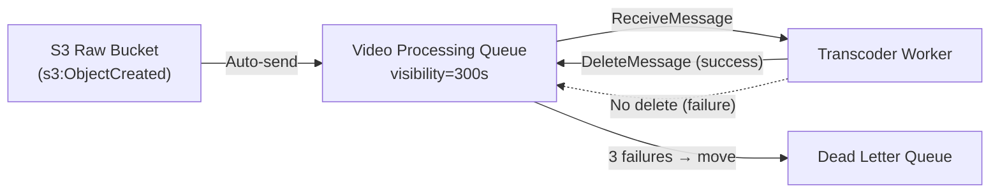
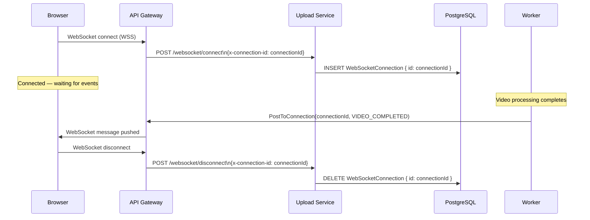

# AWS Services Reference

For each AWS service used by Flux, this document explains the selection rationale, evaluated alternatives, tradeoffs, cost model, and scaling characteristics.

---

## EC2 (Elastic Compute Cloud)

### Why EC2?

All application containers (Nginx, Upload Service, Frontend, Transcoder Worker, PostgreSQL, Redis) run on a single EC2 `t3.small` instance using Docker Compose. EC2 was selected over ECS/Fargate for the following reasons:

- **Operational simplicity**: Docker Compose on EC2 provides container isolation without the overhead of ECS task definitions, service discovery, ALB target groups, and ECR image management.
- **FFmpeg compatibility**: FFmpeg requires a persistent filesystem for temp/scratch directories during transcoding. EC2 provides this natively; Fargate's ephemeral storage requires more complex volume management.
- **Cost**: A `t3.small` costs ~$15/month (ap-south-1). An equivalent ECS Fargate setup would require an ALB (~$17/month) + task compute, totaling 2–3x more.

### Instance Specification

| Property | Value |
|---|---|
| Type | `t3.small` |
| vCPUs | 2 (burstable) |
| RAM | 2 GB |
| Storage | 30 GB gp2 EBS |
| Network | Up to 5 Gbps burst |
| Region | `ap-south-1` (Mumbai) |
| AMI | `ami-03bb6d83c60fc5f7c` (Ubuntu 22.04) |

### Alternatives Considered

| Alternative | Why Not Chosen |
|---|---|
| ECS Fargate | Higher cost, no persistent volume for FFmpeg scratch space without EFS |
| Lambda | 15-minute max execution time; insufficient for large video transcoding |
| Elastic Beanstalk | Adds abstraction layers without meaningful benefit at this scale |
| Kubernetes (EKS) | Significant operational overhead; overkill for single-instance deployment |

### Scaling Characteristics

- **Vertical**: Upgrade to `t3.medium` (4 GB RAM) for larger videos or `c5.large` (compute-optimised) for faster FFmpeg
- **Horizontal**: Worker can be independently scaled by increasing `deploy.replicas` in docker-compose — each replica polls SQS independently. SQS message visibility timeout prevents duplicate processing.
- **Burstable CPU**: `t3` instances accumulate CPU credits during idle periods, which are spent during transcoding bursts. Sustained heavy load will exhaust credits.

### Cost Estimate

| Component | Monthly Cost |
|---|---|
| EC2 t3.small (on-demand) | ~$15.18 |
| EBS gp2 30 GB | ~$3.00 |
| Elastic IP (associated) | $0.00 |
| Data transfer (first 1 GB free) | ~$2–10 |
| **Total** | **~$20–28/month** |

---

## S3 (Simple Storage Service)

### Why S3?

S3 is the backbone of Flux's storage layer. Three separate buckets serve distinct purposes with different security postures.

**Key decisions**:
- **Bucket separation**: Raw, processed, and thumbnails are separate buckets. This enables independent lifecycle policies, IAM permissions, and bucket policies. A single "videos" bucket would require prefix-based policies, which are harder to reason about.
- **Versioning on processed/thumbnails**: If a re-transcode overwrites HLS artifacts, versioning allows rollback to the previous version.
- **7-day lifecycle on raw bucket**: Raw uploads are large binary files. After transcoding, they are no longer needed. Automatic deletion saves storage costs.

### Bucket Configuration Summary

| Bucket | Public Access | Versioning | Lifecycle | Trigger |
|---|---|---|---|---|
| raw-videos | Blocked | Enabled | 7-day expiry | → SQS event |
| processed-videos | Blocked | Enabled | None | None |
| thumbnails | Blocked | Enabled | None | None |

### Alternatives Considered

| Alternative | Why Not Chosen |
|---|---|
| EFS (Elastic File System) | Higher cost per GB; unnecessary for object storage |
| Direct EC2 disk storage | Not durable; lost on instance termination |
| Cloudinary / Mux | Vendor lock-in; eliminates learning opportunity for AWS-native architecture |

### CORS Configuration

The raw-videos bucket allows `PUT`, `POST`, `GET`, `HEAD` from any origin (required for browser-direct pre-signed POST uploads). The processed-videos bucket allows only `GET`, `HEAD` — CloudFront requests do not require CORS headers.

### Cost Estimate

| Component | Estimate | Notes |
|---|---|---|
| Storage (processed videos) | $0.023/GB/month | Scales linearly |
| PUT requests | $0.005/1,000 | Per segment uploaded |
| GET requests | $0.0004/1,000 | CloudFront fetches from S3 (cache misses only) |
| Data transfer to CloudFront | Free | S3 → CloudFront transfer is free |

---

## SQS (Simple Queue Service)

### Why SQS?

SQS is the critical decoupling layer between video upload detection and processing.

**Key properties chosen**:

- **Standard queue (not FIFO)**: Order does not matter for video processing. Standard queues offer higher throughput and lower cost.
- **Visibility timeout: 300 seconds**: Large videos can take 5+ minutes to transcode. The visibility timeout must exceed the worst-case processing time. If the message becomes visible before processing completes, a second worker instance may pick it up and process the video twice.
- **DLQ after 3 receives**: If a video consistently fails to process (e.g., corrupted file, FFmpeg bug), it moves to the DLQ after 3 attempts. This prevents infinite retry loops.

### Message Flow



### Alternatives Considered

| Alternative | Why Not Chosen |
|---|---|
| SNS → Lambda | Lambda 15-min timeout insufficient; cold starts add latency |
| RabbitMQ | Requires self-managed broker; SQS is fully managed |
| Redis Queue (Bull/BullMQ) | Requires Redis cluster for durability; SQS is more reliable |
| EventBridge | More suited to complex event routing; unnecessary overhead |

### Cost Estimate

| Component | Cost |
|---|---|
| First 1M requests/month | Free (AWS Free Tier) |
| After 1M | $0.40/million requests |
| DLQ storage | Same pricing |

---

## CloudFront

### Why CloudFront?

CloudFront is the secure, globally distributed delivery layer for all video content. It serves HLS segments and thumbnails from edge caches, reducing S3 access and improving play start latency for users globally.

**Critical functions**:
1. **OAC (Origin Access Control)**: CloudFront signs every S3 request with SigV4. The S3 bucket policy only allows reads from the CloudFront distribution ARN. Direct S3 URLs always return 403.
2. **Signed Cookies**: A single cookie set (`CloudFront-Policy`, `CloudFront-Signature`, `CloudFront-Key-Pair-Id`) authorizes access to all objects under `hls/{videoId}/*`. This is essential for HLS which makes hundreds of requests per video.
3. **CORS Policy**: A custom `ResponseHeadersPolicy` returns the correct CORS headers for credentialed requests from the frontend origin, enabling HLS.js to read manifests and segments across the domain boundary.

### Distribution Configuration

| Setting | Value |
|---|---|
| Origins | processed-videos S3, thumbnails S3 |
| Default behavior | signed cookies required; OAC SigV4 |
| `/thumbnails/*` behavior | no signed cookies; OAC SigV4 |
| Price class | PriceClass_100 (US, EU, Asia) |
| Minimum TLS | TLSv1.2_2021 |
| Custom domain | cdn.masir-projects.me (ACM cert) |
| Compression | Enabled (gzip/Brotli for .m3u8 manifests) |

### Alternatives Considered

| Alternative | Why Not Chosen |
|---|---|
| Serve directly from S3 | S3 cannot enforce signed cookie authentication |
| Nginx as CDN | No global PoP (Point of Presence); high latency for geographically distributed users |
| Cloudflare CDN | Does not natively integrate with S3 OAC/signed URLs |
| MediaStore + MediaPackage | AWS managed video infrastructure; much higher cost; designed for live streaming |

### Cost Estimate

| Component | Cost |
|---|---|
| Data transfer out | $0.085/GB (first 10 TB, Asia) |
| HTTPS requests | $0.0100/10,000 |
| CloudFront → S3 | Free |

---

## Route53 / DNS

### DNS Strategy

The project uses **Namecheap** as the domain registrar with DNS records pointing to AWS resources:

| Record | Type | Value |
|---|---|---|
| `video-processing.masir-projects.me` | A | EC2 Elastic IP |
| `video-processing-api.masir-projects.me` | A | EC2 Elastic IP |
| `cdn.masir-projects.me` | CNAME | CloudFront distribution domain |
| ACM validation records | CNAME | ACM-provided CNAME for certificate validation |

**Why not Route53?** Route53 is the AWS-native DNS service and would provide tighter integration (alias records for CloudFront, latency routing, health checks). For this project, Namecheap DNS is used to keep all DNS under the existing domain registrar. Migrating to Route53 is a straightforward operational improvement.

### Elastic IP

The EC2 instance has an Elastic IP associated with it. This ensures that the DNS A record does not need to be updated when the instance is stopped and restarted (dynamic public IPs would change).

---

## IAM (Identity and Access Management)

### EC2 Instance Role

The EC2 instance uses an **IAM instance profile** — no long-lived access keys are stored in environment variables or files. The instance role grants:

| Permission | Resource | Use |
|---|---|---|
| `s3:*` | `*` | Worker reads raw videos, writes processed artifacts |
| `sqs:*` | `*` | Worker polls and deletes SQS messages |
| `AmazonSSMManagedInstanceCore` | AWS managed | Enables SSM Session Manager access (no SSH needed) |
| `CloudWatchAgentServerPolicy` | AWS managed | Enables CloudWatch agent metric publishing |

**Current limitation**: The IAM policies use `*` for both S3 and SQS resources. This violates least-privilege principles. See [docs/infrastructure/security.md](../infrastructure/security.md) for the recommended tightening.

---

## CloudWatch

### Monitoring Configuration

Terraform provisions:

1. **Log group**: `/aws/container/video-platform-dev` (7-day retention)
2. **Metric filter**: Parses `$.duration` from structured worker logs to create `WorkerProcessingTime` metric
3. **Dashboard**: `Video-Platform-Dashboard` with 6 widgets

### Dashboard Widgets

| Widget | Metric | Purpose |
|---|---|---|
| EC2 CPU Utilization | `AWS/EC2 CPUUtilization` | Detect transcoding CPU saturation |
| EC2 Memory | `CWAgent mem_used_percent` | Detect OOM conditions |
| SQS Queue Depth | `ApproximateNumberOfMessagesVisible` | Detect processing backlog |
| DLQ Messages | DLQ visible messages | Detect systematic failures |
| Worker Processing Time | Custom `WorkerProcessingTime` | Track transcoding performance |
| Upload Count | `SQS NumberOfMessagesSent` | Track upload volume |

---

## API Gateway WebSocket

### Why API Gateway WebSocket?

API Gateway WebSocket provides a fully managed, serverless WebSocket server. This eliminates the need to run a WebSocket server process inside the EC2 instance (which would require sticky load balancing if horizontally scaled).

### Connection Lifecycle



### Route Configuration

| Route Key | Integration | Method | Backend URL |
|---|---|---|---|
| `$connect` | HTTP_PROXY | POST | `/websocket/connect` |
| `$disconnect` | HTTP_PROXY | POST | `/websocket/disconnect` |

The `context.connectionId` from API Gateway is forwarded as the `x-connection-id` header.

### Cost Estimate

| Component | Cost |
|---|---|
| Connection minutes | $0.000250/minute (first 1M free) |
| Messages | $1.00/million |
| AWS Free Tier | 500,000 messages + 1M connection minutes |

---

## SNS (Simple Notification Service)

**Current status**: SNS is listed in the tech stack but is **not actively used** in the current implementation. The S3 → SQS event notification bypasses SNS (direct S3-to-SQS integration). 

**Future use case**: SNS could fan-out a single upload event to multiple subscribers — for example:
- SQS for transcoding
- SNS → Email notification to the uploader
- SNS → Lambda for metadata extraction
- SNS → Another SQS queue for thumbnail generation (if decoupled from the main worker)

---

## ACM (AWS Certificate Manager)

ACM is used exclusively for the CloudFront custom domain TLS certificate. CloudFront requires ACM certificates to be provisioned in `us-east-1` (global region), regardless of where the distribution's origin resources are located.

Terraform uses a provider alias for `us-east-1`:
```hcl
module "acm" {
  providers = { aws = aws.us_east_1 }
  cdn_domain_name = var.cdn_domain_name
  ...
}
```

The certificate is validated via DNS CNAME records (output by Terraform as `acm_validation_records`).

**EC2 TLS** uses **Let's Encrypt / Certbot** (not ACM), because ACM certificates cannot be exported for use outside AWS-managed services like ALB or CloudFront.
