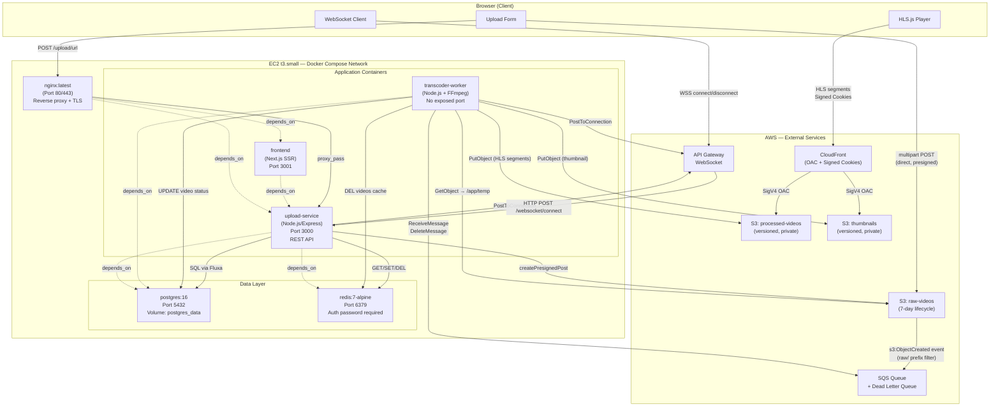
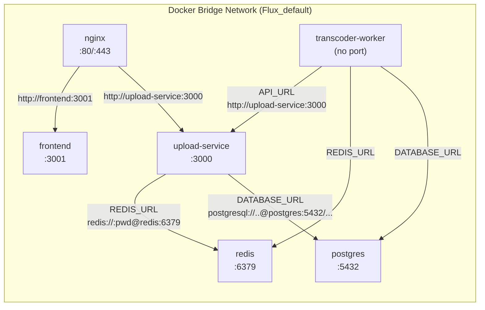
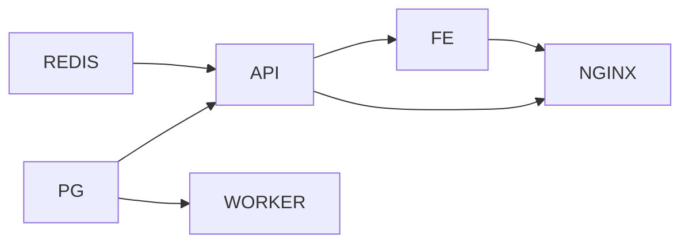

# Container Diagram

This document breaks down the internal runtime components of Flux and explains every inter-container interaction. All containers run on a single EC2 `t3.small` instance using Docker Compose, sharing a single Docker bridge network.

---

## Container Diagram



---

## Container Details

### 1. Nginx (Reverse Proxy)

| Property | Value |
|---|---|
| Image | `nginx:latest` |
| Ports | `80:80`, `443:443` |
| Role | TLS termination, HTTP→HTTPS redirect, rate limiting, request routing |

**Responsibilities**:
- Terminates TLS using Let's Encrypt certificates mounted from `/etc/letsencrypt`
- Routes `video-processing-api.masir-projects.me` → `upload-service:3000`
- Routes `video-processing.masir-projects.me` → `frontend:3001`
- Enforces security headers: HSTS, X-Frame-Options, X-Content-Type-Options, Referrer-Policy
- Applies rate limiting: `limit_req_zone $binary_remote_addr zone=general:10m rate=10r/s`

**Interactions**:
- Receives all inbound HTTPS traffic from the internet
- Proxies to `upload-service` or `frontend` over plain HTTP within Docker network
- Serves Certbot ACME challenge files from `/var/www/certbot` (read-only volume)

---

### 2. Upload Service (Backend API)

| Property | Value |
|---|---|
| Runtime | Node.js 20 + Express |
| Port | `3000` (internal only; exposed via Nginx) |
| Database | PostgreSQL via Fluxa |
| Cache | Redis |

**Endpoints**:
| Method | Path | Purpose |
|---|---|---|
| `GET` | `/health` | Health check for Docker healthcheck |
| `POST` | `/upload/url` | Generate pre-signed S3 POST URL + create DB record |
| `GET` | `/videos` | List all videos (Redis cached, 60s TTL) |
| `GET` | `/videos/:id` | Fetch single video with CloudFront playback URL |
| `GET` | `/videos/:id/playback-cookies` | Issue CloudFront signed cookies |
| `POST` | `/websocket/connect` | Called by API GW; store connection ID |
| `POST` | `/websocket/disconnect` | Called by API GW; remove connection ID |

**Middleware stack** (in order):
1. `express.json()` — body parsing
2. `cors()` — origin whitelisting with credentials support
3. `requestMiddleware` — structured request logging
4. `helmet()` — HTTP security headers
5. `rateLimit()` — 100 requests / 15 minutes per IP
6. Route handlers
7. `errorMiddleware` — catch-all error handler

**Key interactions**:
- PostgreSQL: creates video records on upload, fetches video details for playback
- Redis: caches video list at key `"videos"` with 60s expiry; deleted when worker marks video `COMPLETED`
- S3: generates pre-signed POST using `@aws-sdk/s3-presigned-post`
- CloudFront: generates RSA-signed cookies using `@aws-sdk/cloudfront-signer`
- API Gateway: broadcasts `VIDEO_COMPLETED` events via `PostToConnectionCommand`

---

### 3. Frontend (Next.js)

| Property | Value |
|---|---|
| Runtime | Next.js 14+ (App Router) |
| Port | `3001` |
| Build args | `NEXT_PUBLIC_API_URL`, `NEXT_PUBLIC_WEBSOCKET_URL`, `NEXT_PUBLIC_CLOUDFRONT_DOMAIN` |

**Responsibilities**:
- Serves the video management UI (upload form, video library, video detail page)
- Communicates with the Upload Service REST API
- Opens a WebSocket connection to API Gateway for real-time updates
- Uses `HLS.js` to play adaptive bitrate video from CloudFront

**Key components**:
- `VideoPlayer.jsx` — wraps HLS.js, emits stats + log events
- `VideoDetailLayout.jsx` — video player + pipeline status + S3 Manifest Inspector
- `ManifestInspector.jsx` — fetches and syntax-highlights live HLS playlists from CloudFront
- `StatsForNerds.jsx` — live ABR quality/bitrate analytics overlay
- `HlsDebuggerConsole.jsx` — real-time HLS event log

**Environment at build time** (injected as Docker build args):
```
NEXT_PUBLIC_API_URL=https://video-processing-api.masir-projects.me
NEXT_PUBLIC_WEBSOCKET_URL=wss://{api-id}.execute-api.ap-south-1.amazonaws.com/production
NEXT_PUBLIC_CLOUDFRONT_DOMAIN=https://cdn.masir-projects.me
```

---

### 4. Transcoder Worker

| Property | Value |
|---|---|
| Runtime | Node.js 20 + FFmpeg system binary |
| Exposed port | None |
| Volumes | `/app/temp` (ephemeral scratch space) |
| Replicas | 1 (configurable via `deploy.replicas`) |

**Processing pipeline** (per job):
1. Parse S3 event from SQS message body
2. Extract `videoId` from S3 key (`raw/{uuid}-{filename}`)
3. Create scratch directories: `/app/temp/360p`, `/app/temp/480p`, `/app/temp/720p`, `/app/temp/thumbnails`
4. Download raw video from S3 → `/app/temp/input.mp4`
5. Generate thumbnail at 10% timestamp (640×360 JPEG)
6. Upload thumbnail to `thumbnails/` bucket at `thumbnails/{videoId}.jpg`
7. Transcode three HLS variants in parallel-sequential:
   - 360p @ 800k, `-preset ultrafast`, `-threads 0`, 6-second segments
   - 480p @ 1400k (same settings)
   - 720p @ 2800k (same settings)
8. Write `master.m3u8` with `EXT-X-STREAM-INF` entries
9. Upload 360p, 480p, 720p directories to `hls/{videoId}/` in processed bucket
10. Upload `master.m3u8` to `hls/{videoId}/master.m3u8`
11. Update PostgreSQL: `status=COMPLETED`, `masterPlaylistKey`, `thumbnailKey`
12. Invalidate Redis `"videos"` cache
13. Broadcast `VIDEO_COMPLETED` to all WebSocket connections
14. Clean up all temp files
15. Delete SQS message

**Failure handling**: If any step throws, the error is logged and the message is NOT deleted from SQS. After 3 failed visibility timeouts (visibility = 300s each), SQS moves the message to the Dead Letter Queue.

---

### 5. PostgreSQL

| Property | Value |
|---|---|
| Image | `postgres:16` |
| Port | `5432` (internal Docker network only) |
| Volume | `postgres_data` (Docker named volume, survives container restart) |

**Schema** (two tables):

```sql
-- Video lifecycle record
CREATE TABLE "Video" (
    id                TEXT PRIMARY KEY,         -- UUID, set at presign time
    "fileName"        TEXT NOT NULL,
    "originalS3Key"   TEXT NOT NULL,
    status            TEXT NOT NULL,            -- UPLOADED | COMPLETED | FAILED
    "thumbnailUrl"    TEXT,
    "processedVideoUrl" TEXT,
    "hlsMasterUrl"    TEXT,                     -- 360p variant URL
    "masterPlaylistKey" TEXT,                   -- hls/{videoId}/master.m3u8
    "thumbnailKey"    TEXT,                     -- thumbnails/{videoId}.jpg
    "createdAt"       TIMESTAMP DEFAULT now(),
    "updatedAt"       TIMESTAMP
);

-- WebSocket connection tracking
CREATE TABLE "WebSocketConnection" (
    id           TEXT PRIMARY KEY,              -- API GW connectionId
    "connectedAt" TIMESTAMP DEFAULT now()
);
```

**Access pattern**: Both the Upload Service and the Transcoder Worker connect to the same database using Fluxa ORM with separate schema.Fluxa files (the worker schema does not include the `WebSocketConnection` model).

---

### 6. Redis

| Property | Value |
|---|---|
| Image | `redis:7-alpine` |
| Port | `6379` (internal Docker network only) |
| Auth | Password via `--requirepass ${REDIS_PASSWORD}` |

**Usage pattern**:
- `GET videos` → return cached JSON array of all videos (TTL: 60s)
- `SET videos <json>` → set after fresh PostgreSQL read
- `DEL videos` → invalidated by worker after marking a video `COMPLETED`

This is a **write-through invalidation** pattern (not write-through cache): the cache is populated lazily on first read and explicitly invalidated on write. This avoids stale data while keeping reads fast.

---

## Inter-Container Communication



All service-to-service communication inside Docker uses Docker DNS service names (e.g., `postgres`, `redis`, `upload-service`) which Docker resolves to container IPs on the bridge network. No external DNS is required for intra-container communication.

---

## Dependency Order



Docker Compose `depends_on` ensures containers start in this order. Note that `depends_on` in Docker Compose only waits for the container to start, not for the service inside to be healthy. The Upload Service has an explicit healthcheck (`wget /health`) so dependent services wait for it to become healthy.
