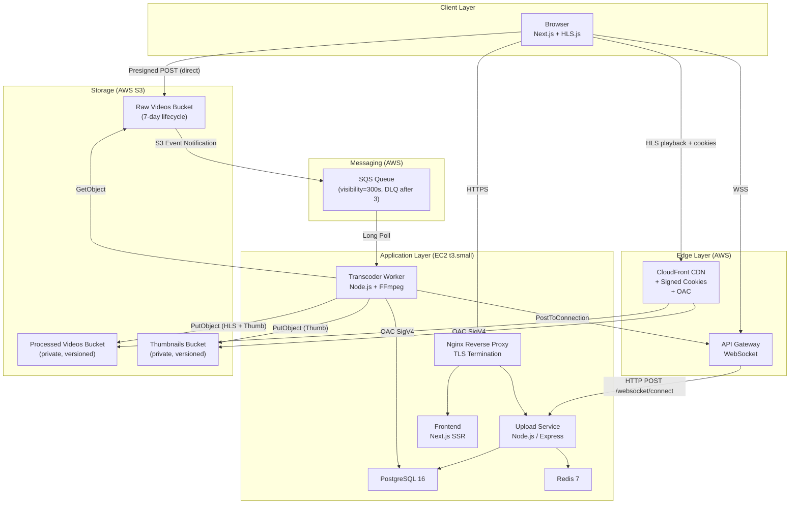
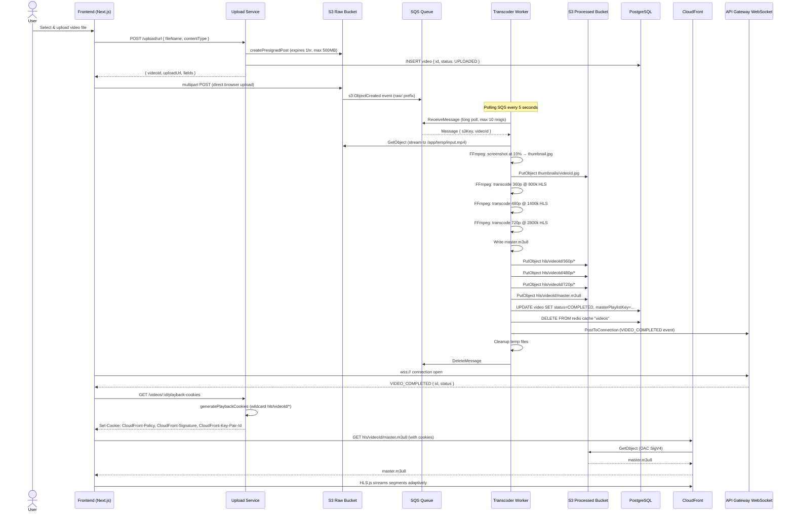

# Architecture Overview

## Executive Summary

**Flux** is a cloud-native distributed video processing and adaptive streaming platform built on AWS. It enables users to upload raw video files, automatically transcode them into multiple HLS (HTTP Live Streaming) quality variants, and deliver them globally via a CloudFront CDN — all in real time, with live WebSocket status updates pushed to the browser.

The platform is built using the **event-driven worker pattern**: a lightweight upload service offloads all compute-intensive FFmpeg transcoding to a dedicated background worker that consumes jobs from an SQS queue, ensuring the API layer remains fast and non-blocking regardless of video size or transcoding load.

---

## Problem Statement

Traditional video hosting architectures suffer from several critical failure modes:

| Problem | Impact |
|---|---|
| Synchronous transcoding in the API layer | API timeouts for large files; poor user experience |
| Single quality bitrate streaming | Rebuffering on poor network connections |
| Direct S3 public access | Security exposure; no token-based access control |
| No real-time status | Users have no feedback during long processing jobs |
| Manual infrastructure | Inconsistent environments, slow provisioning |

Flux solves all of the above with a purpose-built architecture.

---

## System Goals

| Goal | Implementation |
|---|---|
| **Scalable upload ingestion** | Pre-signed S3 POST — browser uploads directly to S3, bypassing the API server |
| **Non-blocking transcoding** | SQS decouples upload from processing; worker runs independently |
| **Adaptive bitrate streaming (ABR)** | FFmpeg generates 360p / 480p / 720p HLS variants with a master playlist |
| **Secure video delivery** | CloudFront + OAC + signed cookies; S3 bucket is fully private |
| **Real-time progress** | API Gateway WebSocket pushes `VIDEO_COMPLETED` events to all connected browsers |
| **Reproducible infrastructure** | Terraform provisions all AWS resources; GitHub Actions deploys the application |

---

## Non-Goals

- **Multi-tenant isolation** — all videos share the same processing queue and storage; no per-tenant namespacing is currently implemented.
- **4K / 1080p transcoding** — the current preset supports up to 720p. This is a deliberate cost/complexity tradeoff.
- **DRM (Widevine / FairPlay)** — signed cookies provide session-level access control, not per-device hardware DRM.
- **Live streaming** — the pipeline is VOD (Video on Demand) only; the HLS playlist type is `VOD`, not `LIVE` or `EVENT`.
- **Video editing / clipping** — the platform is upload-and-stream only.

---

## High-Level Architecture

---

## Design Principles

### 1. Browser-to-S3 Direct Upload
The browser uploads raw video **directly** to S3 using a pre-signed POST URL. The API server is never a data pipe — it only generates the URL and metadata record. This means:
- The API never handles large binary payloads
- Upload speed is limited only by the user's network and S3 throughput
- The API remains at O(1) memory regardless of file size

### 2. Event-Driven Decoupling via SQS
S3 automatically fires an event notification to SQS when the upload completes. The transcoder worker polls SQS independently. This means:
- The API does not call the worker directly (no coupling)
- If the worker restarts, messages are re-queued and retried
- Worker can be horizontally scaled by simply launching more replicas

### 3. Defense-in-Depth for Video Delivery
Processed videos **never have public S3 access**. Access flows exclusively through CloudFront, enforced by:
- **OAC (Origin Access Control)** — CloudFront signs requests to S3 using SigV4. The bucket policy only allows `s3:GetObject` from the CloudFront distribution's ARN.
- **Signed Cookies** — the API generates a wildcard-scoped cookie (`hls/videoId/*`) valid for 2 hours. HLS.js attaches cookies automatically on every segment fetch.

### 4. Stateless Worker
The transcoder worker holds no persistent state. All inputs come from S3, all outputs go to S3, and all status updates go to PostgreSQL. This means a crashed worker can be replaced with zero data loss.

### 5. Infrastructure as Code
Every AWS resource is defined in Terraform under `infra/terraform/modules/`. There are no click-ops resources. State is managed locally (future: S3 backend with DynamoDB lock).

---

## Technical Challenges

| Challenge | Solution |
|---|---|
| FFmpeg CPU saturation on large files | `ultrafast` preset + `-threads 0` (use all CPU cores) |
| CloudFront CORS for credentialed cookie requests | Custom `ResponseHeadersPolicy` whitelisting `CloudFront-*` cookies and specific origins |
| WebSocket connection persistence across HTTP restarts | Connection IDs stored in PostgreSQL; connections are re-established on page load |
| SQS message ID extraction from raw S3 events | Worker parses `Records[0].s3.object.key`, URL-decodes it, and extracts the UUID prefix |
| CloudFront signed cookie key management | RSA key pair generated offline; public key uploaded to CloudFront key group via Terraform; private key mounted as volume |

---

## Key Architectural Decisions

### ADR-001: SQS over SNS for Worker Trigger
**Decision**: Use S3 → SQS event notification (not SNS → Lambda).

**Rationale**: SQS provides at-least-once delivery with visibility timeout and a DLQ, giving the worker time to process large files without message re-delivery. Lambda cold starts and 15-minute timeouts are insufficient for transcoding jobs that may run 5–20 minutes.

### ADR-002: EC2 over ECS/Fargate
**Decision**: Deploy all services on a single EC2 `t3.small` using Docker Compose.

**Rationale**: For a portfolio/MVP workload, ECS adds operational overhead (task definitions, service discovery, ALB target groups). Docker Compose on EC2 provides the same container isolation at 1/10th the complexity. The architecture is designed to migrate to ECS with minimal changes.

### ADR-003: CloudFront Signed Cookies over Signed URLs
**Decision**: Use signed cookies (`CloudFront-Policy`, `CloudFront-Signature`, `CloudFront-Key-Pair-Id`) instead of per-object signed URLs.

**Rationale**: HLS playback requires hundreds of requests (master playlist + variant playlists + individual `.ts` segments). Generating and embedding a signed URL in every segment reference is impractical. A single cookie set covers the entire `hls/videoId/*` namespace.

### ADR-004: PostgreSQL over DynamoDB
**Decision**: Use PostgreSQL (via Fluxa) for video metadata.

**Rationale**: Video metadata has strong relational structure and the query patterns (find by ID, list with ordering) map cleanly to SQL. PostgreSQL is also the most operator-familiar database. DynamoDB would add unnecessary complexity for the current scale.

### ADR-005: Redis for Video List Cache
**Decision**: Cache the `GET /videos` response in Redis with a 60-second TTL.

**Rationale**: The video list is read on every page load and is expensive to compute from PostgreSQL (full table scan + sort). Redis invalidation is triggered explicitly when a new video is marked `COMPLETED`, so the cache is always consistent within 60 seconds.

---

## End-to-End Flow

