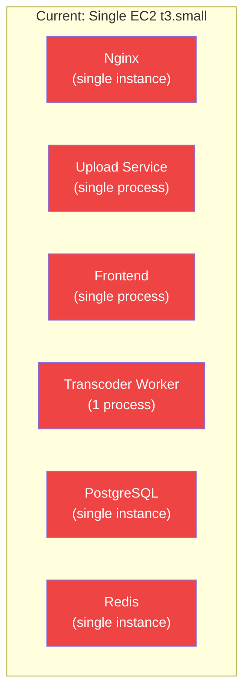
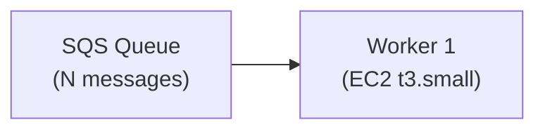
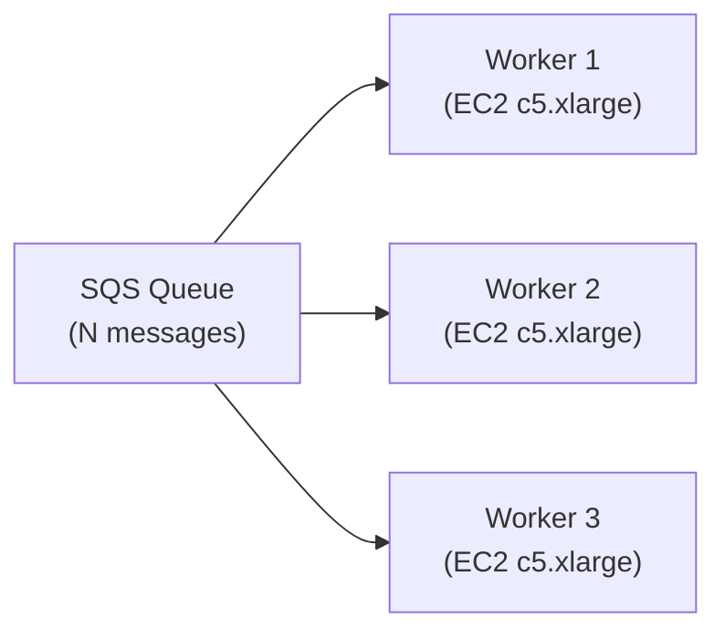
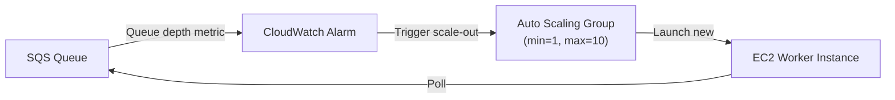
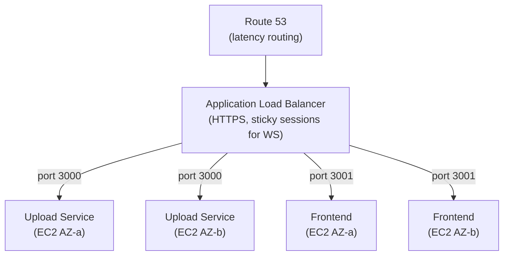
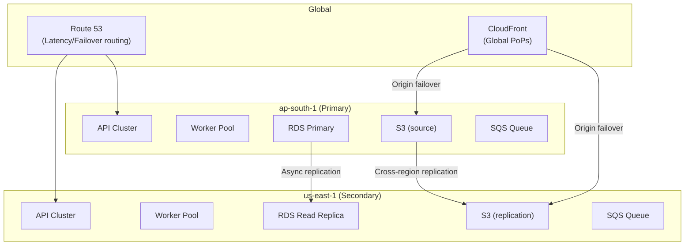

# Scalability

This document analyzes Flux's current scalability characteristics, identifies single points of failure and bottlenecks, and proposes a concrete upgrade path from the current single-instance architecture to a production-grade distributed system.

---

## Current Architecture Limitations



**Every component on a single EC2 instance is a SPOF (Single Point of Failure)**. If the instance stops, the entire platform is unavailable.

### Current Scale Limits

| Component | Current Capacity | Bottleneck |
|---|---|---|
| Upload Service | ~50 concurrent requests | Single Node.js process on 2 vCPU |
| Transcoder Worker | 1 video at a time | FFmpeg uses all CPU during transcode |
| PostgreSQL | ~100 concurrent connections | Single instance; no read replicas |
| Redis | ~1,000 ops/sec | Single instance; no cluster |
| EC2 (`t3.small`) | 2 vCPU, 2 GB RAM | Bursts to max on transcoding; no auto-scaling |
| SQS Queue | Unlimited | Not a bottleneck |
| CloudFront | 10+ Tbps globally | Not a bottleneck for this scale |
| S3 | 5,500 GET + 3,500 PUT/prefix/sec | Not a bottleneck |

---

## Horizontal Scaling: Transcoder Worker

The worker is the most natural scaling target because SQS provides built-in work distribution.

### Current State



### Scaled State



**Why this works**: SQS `VisibilityTimeout=300s` ensures that a message being processed by Worker 1 is invisible to Workers 2 and 3. If Worker 1 crashes, the message becomes visible again after 300s and another worker picks it up.

**Implementation**: Simply launch more instances or Docker containers with the same worker image and environment variables. No code changes required.

**Recommended worker instance type for scale**: `c5.xlarge` (4 vCPU, 8 GB RAM) — compute-optimised for FFmpeg workloads.

---

## Auto Scaling: SQS-Triggered ASG

For elastic scaling, connect an Auto Scaling Group to SQS queue depth:



```python
# Scale-out policy: add 1 worker when queue depth > 5 for 5 minutes
# Scale-in policy: remove 1 worker when queue depth = 0 for 15 minutes
```

**Target tracking scaling**: AWS ASG can directly track a custom metric (e.g., messages per worker). When messages/worker > 2, add capacity.

---

## Multi-Instance API Tier

To scale the Upload Service and Frontend:



**WebSocket consideration**: API Gateway handles WebSocket connections independently of the application tier. The `PostToConnection` call from the worker goes directly to API Gateway, which maintains the connection to the browser. No sticky sessions required for WebSocket.

---

## Database Scaling

### Current → Phase 1: RDS PostgreSQL

| Property | Current (Docker) | Phase 1 (RDS) |
|---|---|---|
| Engine | PostgreSQL 16 | PostgreSQL 16 on RDS |
| Availability | Single EC2 | Multi-AZ (primary + standby) |
| Backup | Manual EC2 snapshot | Automated daily backups, PITR |
| Read scaling | None | RDS Read Replica |
| Connection pooling | None (Fluxa default) | RDS Proxy (PgBouncer-as-a-service) |
| Failover | Manual restart | Automatic (< 60s) |

**Migration path**:
1. Create RDS instance in the same VPC with private subnet placement
2. Dump PostgreSQL data: `docker compose exec postgres pg_dump > backup.sql`
3. Restore to RDS: `psql -h rds-endpoint -U admin video_platform < backup.sql`
4. Update `DATABASE_URL` in `.env` to point to RDS endpoint
5. Decommission Docker postgres container

### Phase 2: Connection Pooling with RDS Proxy

Each Fluxa client opens a connection pool. With 3 API instances × 10 connections = 30 database connections. RDS Proxy aggregates these and efficiently manages connections to the underlying database, significantly reducing connection overhead.

---

## Cache Scaling

### Current → ElastiCache Redis

| Property | Current (Docker) | Production (ElastiCache) |
|---|---|---|
| Availability | Single instance | Cluster mode with replicas |
| Persistence | Ephemeral (container restart = empty cache) | AOF persistence |
| Network | Docker bridge | VPC-native |
| Failover | Manual restart | Automatic (< 60s) |

---

## CloudFront CDN Scaling

CloudFront already scales globally. Improvements for scale:

1. **Cache-Control Headers**: Set proper headers on HLS segments to maximize edge caching and reduce origin fetches.

```js
// In worker's S3 upload code:
CacheControl: key.endsWith(".ts") ? "max-age=31536000, immutable" : "max-age=3600"
```

2. **S3 Transfer Acceleration**: For users far from `ap-south-1`, S3 Transfer Acceleration can speed up raw video uploads by routing through the nearest CloudFront edge point.

3. **CloudFront Price Class**: Upgrade from `PriceClass_100` to `PriceClass_All` for global coverage including South America and Australia.

---

## Multi-Region Architecture (Long-Term)



---

## Scalability Roadmap

### Phase 1: Single Instance Hardening (Current Priority)
- [ ] Move PostgreSQL and Redis to RDS and ElastiCache
- [ ] Add CloudWatch alarms for DLQ, CPU, and memory
- [ ] Add proper `Cache-Control` headers to HLS segments
- [ ] Restrict IAM policies to least privilege

### Phase 2: Worker Horizontal Scaling
- [ ] Extract worker to separate EC2 instance
- [ ] Configure Auto Scaling Group with SQS target tracking
- [ ] Add worker health check endpoint
- [ ] Use Spot Instances for 70% cost savings

### Phase 3: API High Availability
- [ ] Deploy API behind Application Load Balancer
- [ ] Run 2+ API instances across 2 AZs
- [ ] Enable RDS Multi-AZ and automated backups
- [ ] Add RDS Proxy for connection pooling

### Phase 4: Container Orchestration
- [ ] Migrate Docker Compose to ECS (Elastic Container Service)
- [ ] Use Fargate for serverless container execution
- [ ] Implement ECR for container image registry
- [ ] Add CodePipeline for blue-green deployments

### Phase 5: Global Distribution
- [ ] Multi-region active-active for API
- [ ] S3 Cross-Region Replication for low-latency playback
- [ ] Route 53 latency-based routing

---

## Performance at Scale: Estimates

| Concurrent Videos | Workers Required | EC2 Cost/month | Processing Latency |
|---|---|---|---|
| 1 (current) | 1 × t3.small | ~$15 | 3–5 min (50 MB) |
| 5 | 5 × c5.large | ~$200 | 3–5 min |
| 50 | 10 × c5.2xlarge | ~$1,500 | 3–5 min |
| 500 | 50 × c5.2xlarge (Spot) | ~$2,000 | 3–5 min |
| 5,000 | AWS Elemental MediaConvert | ~$5,000+ | 1–3 min (GPU) |

**AWS Elemental MediaConvert** at extreme scale (5,000+ concurrent): A fully managed transcoding service with GPU acceleration. Pricing is per-minute of transcoded output, not per-instance, making it cost-effective at high volume. It eliminates the need for self-managed FFmpeg workers entirely.

---

## Statelessness and Scaling Properties

| Component | Stateless? | Scaling Implication |
|---|---|---|
| Upload Service | ✅ Yes | Horizontally scalable behind ALB |
| Frontend | ✅ Yes | Horizontally scalable behind ALB |
| Transcoder Worker | ✅ Yes | Horizontally scalable — each instance polls SQS |
| Nginx | ✅ Yes | Scale with API/Frontend (reverse proxy) |
| PostgreSQL | ❌ No | Requires leader-follower replication |
| Redis | ❌ No | Requires cluster mode for scaling |
| SQS | ✅ Managed | No scaling required |
| CloudFront | ✅ Managed | Global by default |
| S3 | ✅ Managed | Infinite scale |

The worker being stateless is a key design advantage — it can be scaled to 1, 10, or 100 instances without any code changes.
