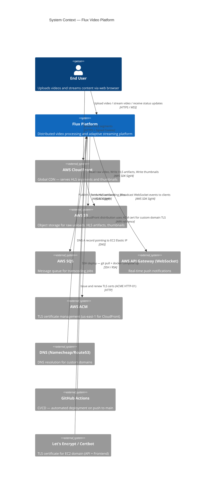
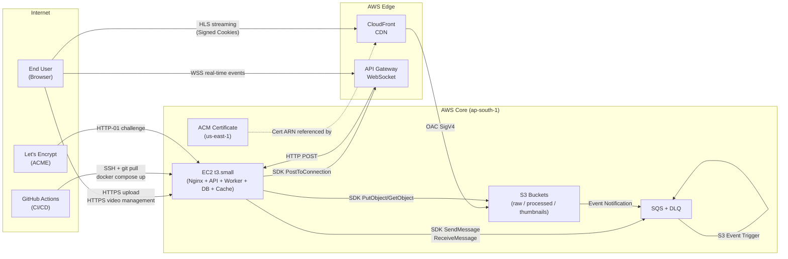
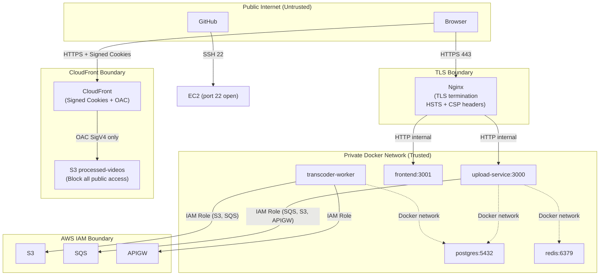

# System Context

## Purpose

This document describes the system boundaries of Flux — which external systems it interacts with, how users interact with it, and where the security perimeter lies. It is the entry-point document for any architect evaluating how Flux fits into a broader organisational technology landscape.

---

## System Context Diagram



> **Note**: The C4Context syntax above is illustrative. Most Mermaid renderers support the `graph TD` form; the intent is identical.

---

## Simplified Mermaid Version



---

## External Systems

### AWS S3 (Three Buckets)

| Bucket | Role | Access Pattern | Lifecycle |
|---|---|---|---|
| `raw-videos` | Receives browser direct uploads via pre-signed POST | Write by browser, Read by worker | Objects auto-deleted after 7 days |
| `processed-videos` | Stores HLS artifacts (master + variant playlists + `.ts` segments) | Write by worker, Read by CloudFront (OAC) | Versioning enabled; no expiry |
| `thumbnails` | Stores JPEG thumbnails generated from video frame | Write by worker, Read by CloudFront | Versioning enabled; no expiry |

**Security model**: Both `processed-videos` and `thumbnails` have `BlockPublicAccess` fully enabled. No direct S3 URL ever reaches the browser. All access goes through CloudFront, and CloudFront authenticates to S3 using **OAC SigV4** — a more secure successor to OAI (Origin Access Identity).

---

### AWS SQS

The SQS queue acts as the decoupling layer between upload detection and transcoding. S3 fires `s3:ObjectCreated:*` events on the `raw/` prefix directly to SQS — no Lambda or SNS intermediate.

| Property | Value |
|---|---|
| Queue type | Standard (at-least-once delivery) |
| Visibility timeout | 300 seconds (5 minutes) |
| Dead Letter Queue | After 3 failed receive attempts |
| Max message retention | 4 days (default) |
| S3 trigger prefix filter | `raw/` |

---

### AWS CloudFront

A single CloudFront distribution serves both processed videos and thumbnails with two origins:

| Behavior | Origin | Auth |
|---|---|---|
| Default (`/*`) | processed-videos S3 | Signed cookies required, OAC SigV4 |
| `/thumbnails/*` | thumbnails S3 | No signed cookies required, OAC SigV4 |

- **Price class**: `PriceClass_100` (US, Europe, Asia — excludes South America, Australia for cost)
- **TLS**: ACM certificate provisioned in `us-east-1` (CloudFront requirement), SNI-only, TLS 1.2+
- **CORS**: Custom `ResponseHeadersPolicy` whitelists the frontend and API origins with `access_control_allow_credentials = true`

---

### AWS API Gateway WebSocket

A serverless WebSocket endpoint accepts connections from browsers. Connection lifecycle:

1. Browser connects → API GW fires `$connect` → HTTP POST to `upload-service/websocket/connect`
2. `upload-service` stores the `connectionId` in PostgreSQL `WebSocketConnection` table
3. Worker calls `PostToConnection` on API GW management API with `VIDEO_COMPLETED` payload
4. Browser disconnects → API GW fires `$disconnect` → connection record deleted

**Management endpoint**: `https://{api-id}.execute-api.{region}.amazonaws.com/{stage}` — the worker uses this URL to push messages via the SDK.

---

### GitHub Actions

A single workflow (`deploy.yml`) triggers on `push` to `main`. It SSHes into the EC2 instance and runs:

```bash
git fetch origin main
git reset --hard origin/main
cd infra/docker
docker compose up -d --build
docker compose restart nginx
docker image prune -f
```

**Secrets required**: `EC2_HOST`, `EC2_USER`, `EC2_SSH_KEY`, `PROJECT_PATH`

---

### Let's Encrypt / Certbot

TLS certificates for `video-processing-api.masir-projects.me` and `video-processing.masir-projects.me` are issued via Certbot ACME HTTP-01 challenge. Nginx serves the `.well-known/acme-challenge/` path from `/var/www/certbot`. Certificates are stored in `/etc/letsencrypt` and mounted read-only into the Nginx container.

---

## User Interactions

| Interaction | Flow |
|---|---|
| **Upload video** | Browser → POST `/upload/url` → API → S3 presigned POST (direct) |
| **View video list** | Browser → GET `/videos` → API → Redis (cache hit) or PostgreSQL |
| **Watch video** | Browser → GET `/videos/:id/playback-cookies` → API → cookies set → CloudFront HLS |
| **Live progress** | Browser opens WebSocket → API GW → PostgreSQL → receives `VIDEO_COMPLETED` event |
| **View pipeline status** | Browser polls GET `/videos/:id` every 7 seconds until status = `COMPLETED` |

---

## Security Boundaries



**Key security boundaries**:
- PostgreSQL and Redis are **not** exposed to the public internet (Docker internal network only)
- S3 processed bucket has all public access blocked; only CloudFront can read it
- The EC2 IAM role grants S3 and SQS access — no long-lived access keys in environment variables (IAM instance profile)
- Nginx enforces HSTS, X-Frame-Options, and X-Content-Type-Options on all responses
- Rate limiting: 100 requests per 15 minutes per IP (Express), 10 req/s with burst=20 (Nginx)
