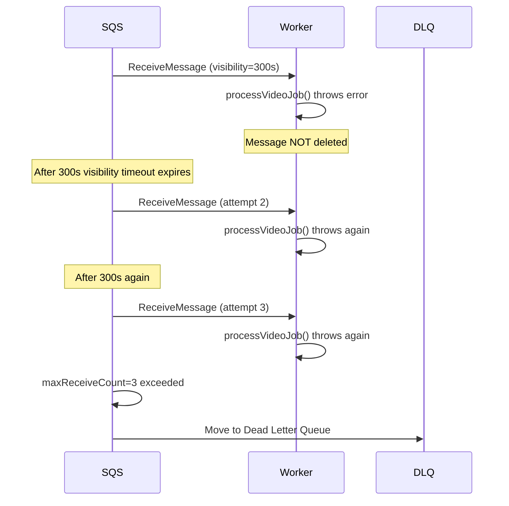

# Video Processing Pipeline

This document provides a deep technical explanation of every stage in the Flux video pipeline — from the browser upload click to a fully playable adaptive stream on CloudFront.

---

## Pipeline Overview


---

## Stage 1: Upload Lifecycle

### 1.1 Pre-signed URL Generation

When the user selects a file and clicks upload, the frontend sends:

```http
POST /upload/url
Content-Type: application/json

{
  "fileName": "demo-reel.mp4",
  "contentType": "video/mp4"
}
```

The upload service validates:
- `fileName` and `contentType` are present
- `contentType` is one of: `video/mp4`, `video/quicktime`, `video/x-msvideo`

Then calls `createPresignedPost` from `@aws-sdk/s3-presigned-post`:

```js
const { url, fields } = await createPresignedPost(s3Client, {
  Bucket: process.env.RAW_BUCKET_NAME,
  Key: `raw/${videoId}-${fileName}`,
  Conditions: [
    ["content-length-range", 0, 524288000],   // max 500 MB
    ["eq", "$Content-Type", contentType],
  ],
  Fields: { "Content-Type": contentType },
  Expires: 3600,  // URL valid for 1 hour
});
```

The S3 key format is: `raw/{uuid}-{originalFileName}`. The UUID is generated with `uuidv4()` and becomes the permanent `videoId` for the lifetime of the video.

A video record is immediately created in PostgreSQL with `status: "UPLOADED"`.

**Response**:
```json
{
  "videoId": "a1b2c3d4-...",
  "uploadUrl": "https://Flux-raw-videos.s3.ap-south-1.amazonaws.com/",
  "fields": {
    "key": "raw/a1b2c3d4-demo-reel.mp4",
    "Content-Type": "video/mp4",
    "X-Amz-Credential": "...",
    "X-Amz-Algorithm": "AWS4-HMAC-SHA256",
    "X-Amz-Date": "...",
    "Policy": "...",
    "X-Amz-Signature": "..."
  },
  "key": "raw/a1b2c3d4-demo-reel.mp4"
}
```

### 1.2 Browser Direct Upload to S3

The frontend constructs a `FormData` object including all `fields` and the raw file binary, then submits it directly to S3's pre-signed endpoint. The API server is **never** in the data path for the raw file.

```
Browser → POST https://s3.ap-south-1.amazonaws.com/ (multipart)
  [Policy, Credential, Signature, Content-Type, file binary]
S3 → 204 No Content (success)
```

**Why pre-signed POST and not PUT?**
- Pre-signed POST allows server-enforced conditions (file size limit, content type restriction) that are cryptographically signed
- Pre-signed PUT does not support condition enforcement

---

## Stage 2: Queue Trigger

### 2.1 S3 → SQS Event Notification

Terraform configures an S3 bucket notification on the raw bucket:

```hcl
resource "aws_s3_bucket_notification" "raw_upload_events" {
  bucket = aws_s3_bucket.raw_videos.id
  queue {
    queue_arn     = var.video_queue_arn
    events        = ["s3:ObjectCreated:*"]
    filter_prefix = "raw/"
  }
}
```

When S3 receives the multipart upload completion, it automatically sends an event to SQS. The SQS queue policy allows `s3.amazonaws.com` to call `sqs:SendMessage`.

**SQS message body** (abbreviated):
```json
{
  "Records": [{
    "s3": {
      "bucket": { "name": "Flux-dev-masir-raw-videos" },
      "object": {
        "key": "raw/a1b2c3d4-demo-reel.mp4",
        "size": 44040192
      }
    }
  }]
}
```

### 2.2 Queue Properties

| Property | Value | Rationale |
|---|---|---|
| Visibility timeout | 300s (5 min) | Gives FFmpeg time to transcode a 50 MB video. The message is hidden from other consumers while being processed. |
| Max receive count | 3 | If a message is received 3 times and never deleted, it moves to the DLQ. |
| DLQ | Separate queue | Failed messages are preserved for manual inspection and replay |

---

## Stage 3: Worker Job Processing

### 3.1 SQS Polling

The worker runs an infinite polling loop:

```js
while (true) {
  const messages = await pollMessages();
  if (!messages.length) {
    await new Promise(resolve => setTimeout(resolve, 5000));
    continue;
  }
  await Promise.all(messages.map(async (message) => {
    // ... process
  }));
}
```

The 5-second sleep between empty polls prevents runaway API calls. `pollMessages()` uses SQS long polling (up to 20 seconds) to reduce API calls when the queue is idle.

### 3.2 Key Extraction

```js
const s3Event = JSON.parse(message.Body);
const record = s3Event.Records[0];
const s3Key = decodeURIComponent(record.s3.object.key);
// s3Key = "raw/a1b2c3d4-demo-reel.mp4"

const fileName = s3Key.split("/").pop();
// fileName = "a1b2c3d4-demo-reel.mp4"

const videoId = fileName.substring(0, 36);
// videoId = "a1b2c3d4-..." (UUID is always 36 chars)
```

The `decodeURIComponent` call is critical — S3 URL-encodes special characters in object keys (e.g., spaces become `+`).

### 3.3 Temp Directory Setup

```js
const SCRATCH_DIRS = ["/app/temp/360p", "/app/temp/480p", "/app/temp/720p", "/app/temp/thumbnails"];
SCRATCH_DIRS.forEach(dir => fs.mkdirSync(dir, { recursive: true }));
```

These directories persist inside the container for the duration of the job, then are explicitly cleaned up.

---

## Stage 4: Thumbnail Generation

```js
function generateThumbnail(inputPath, outputPath) {
  return new Promise((resolve, reject) => {
    ffmpeg(inputPath)
      .screenshots({
        timestamps: ["10%"],        // capture at 10% of video duration
        filename: "thumbnail.jpg",
        folder: outputPath,
        size: "640x360",            // 16:9 thumbnail
      })
      .on("end", resolve)
      .on("error", reject);
  });
}
```

**Why 10%?** The first few percent of a video is often title cards, black screens, or fade-in. 10% typically captures representative content.

The thumbnail is immediately uploaded to the thumbnails bucket at `thumbnails/{videoId}.jpg`, then served via CloudFront at `/thumbnails/{videoId}.jpg`. Thumbnails use an ordered cache behavior with no signed cookies required — they are semi-public.

---

## Stage 5: HLS Transcoding

### 5.1 HLS Variant Generation

Three FFmpeg processes run sequentially for the three quality levels:

```js
await createHlsVariant(inputPath, "/app/temp/360p", 360, "800k");
await createHlsVariant(inputPath, "/app/temp/480p", 480, "1400k");
await createHlsVariant(inputPath, "/app/temp/720p", 720, "2800k");
```

Each call:
```js
ffmpeg(inputPath)
  .videoCodec("libx264")
  .size(`?x${height}`)           // scale width proportionally, fix height
  .outputOptions([
    `-b:v ${bitrate}`,            // target video bitrate
    "-preset ultrafast",          // fastest encoding, larger output
    "-profile:v main",            // H.264 Main profile (broad device support)
    "-threads 0",                 // use all available CPU cores
    "-hls_time 6",                // 6-second segments
    "-hls_playlist_type vod",     // VOD playlist (all segments known upfront)
    "-hls_list_size 0",           // keep all segments in the playlist
    "-sc_threshold 0",            // disable scene change detection (more consistent segment sizes)
    `-hls_segment_filename ${outputDir}/segment_%03d.ts`,
  ])
  .output(`${outputDir}/index.m3u8`)
```

**Output structure per variant**:
```
/app/temp/360p/
  index.m3u8
  segment_000.ts
  segment_001.ts
  segment_002.ts
  ...
  segment_NNN.ts
```

### 5.2 FFmpeg Parameter Deep Dive

| Parameter | Value | Rationale |
|---|---|---|
| `libx264` | H.264 codec | Broadest device compatibility (iOS, Android, all browsers) |
| `?x360` sizing | Width auto-calculated | Preserves aspect ratio; prevents black bars or distortion |
| `-b:v 800k` | 800 Kbps for 360p | Matches ABR ladder standards for SD quality |
| `-preset ultrafast` | Fastest encode | Reduces transcoding time by ~5x vs `medium`; slightly larger files |
| `-threads 0` | Auto thread count | Utilises all EC2 vCPUs; critical for large files |
| `-hls_time 6` | 6-second segments | Industry standard; balances seek latency and request overhead |
| `-hls_playlist_type vod` | VOD | Includes `#EXT-X-ENDLIST`; allows full seeking |
| `-sc_threshold 0` | No scene cuts | Produces uniform 6s segments; more predictable buffering |

### 5.3 ABR Bitrate Ladder

| Variant | Resolution | Bitrate | Use Case |
|---|---|---|---|
| 360p | 640×360 | 800 Kbps | Mobile data, slow WiFi |
| 480p | 854×480 | 1,400 Kbps | Standard home broadband |
| 720p | 1,280×720 | 2,800 Kbps | Fast broadband, desktop |

HLS.js selects the appropriate variant based on measured network throughput and buffer health. It can switch between variants mid-playback seamlessly.

---

## Stage 6: Master Playlist Generation

The master playlist is a static file generated from hardcoded values:

```m3u8
#EXTM3U

#EXT-X-STREAM-INF:BANDWIDTH=800000,RESOLUTION=640x360
360p/index.m3u8

#EXT-X-STREAM-INF:BANDWIDTH=1400000,RESOLUTION=854x480
480p/index.m3u8

#EXT-X-STREAM-INF:BANDWIDTH=2800000,RESOLUTION=1280x720
720p/index.m3u8
```

**Design note**: The `BANDWIDTH` values are declared hints for the HLS client. HLS.js uses these to make initial variant selection before measurement data is available. Paths are relative (`360p/index.m3u8`), which means they resolve relative to the master playlist's S3 key prefix.

---

## Stage 7: S3 Upload

All artifacts are uploaded in order:

```js
// 1. Upload variant directories (segments + index.m3u8)
await uploadDirectory("/app/temp/360p", `hls/${videoId}/360p`);
await uploadDirectory("/app/temp/480p", `hls/${videoId}/480p`);
await uploadDirectory("/app/temp/720p", `hls/${videoId}/720p`);

// 2. Upload master playlist last (ensures all segments exist before player starts)
await uploadFile(PROCESSED_BUCKET, `hls/${videoId}/master.m3u8`, "/app/temp/hls/master.m3u8", "application/x-mpegURL");
```

**Why upload master.m3u8 last?** If the master playlist were uploaded first and the client began playing immediately via WebSocket notification, segment requests could arrive at CloudFront before the segments exist in S3, causing 404 errors and buffering failures.

**S3 key structure**:
```
hls/
  {videoId}/
    master.m3u8
    360p/
      index.m3u8
      segment_000.ts
      segment_001.ts
      ...
    480p/
      index.m3u8
      segment_000.ts
      ...
    720p/
      index.m3u8
      segment_000.ts
      ...
thumbnails/
  {videoId}.jpg
```

---

## Stage 8: Database Update & Cache Invalidation

```js
await markVideoProcessed(
  videoId,
  `hls/${videoId}/master.m3u8`,  // masterPlaylistKey
  null,                           // thumbnailUrl (deprecated field)
  `hls/${videoId}/360p/index.m3u8`, // hlsMasterUrl
  thumbnailKey                    // thumbnails/{videoId}.jpg
);
```

Inside `markVideoProcessed`:
```js
await Fluxa.video.update({
  where: { id: videoId },
  data: { status: "COMPLETED", masterPlaylistKey, thumbnailKey, hlsMasterUrl },
});
await redisClient.del("videos"); // explicit cache invalidation
```

The next `GET /videos` request will trigger a fresh PostgreSQL read and re-populate the Redis cache.

---

## Stage 9: WebSocket Broadcast

```js
await notifyVideoCompleted({ id: videoId, status: "COMPLETED" });

// Which calls:
const connections = await Fluxa.webSocketConnection.findMany();
for (const connection of connections) {
  await client.send(new PostToConnectionCommand({
    ConnectionId: connection.id,
    Data: Buffer.from(JSON.stringify({
      type: "VIDEO_COMPLETED",
      video: { id: videoId, status: "COMPLETED" },
    })),
  }));
}
```

Every connected browser receives the event. The frontend reacts by fetching the video record and triggering playback cookie issuance.

**Failure tolerance**: If a `PostToConnection` call fails (e.g., the browser has disconnected but the DB record hasn't been cleaned up), the error is caught and logged per-connection, and the loop continues for remaining connections.

---

## Stage 10: Cleanup

```js
["/app/temp/360p", "/app/temp/480p", "/app/temp/720p", "/app/temp/hls", "/app/temp/thumbnails"]
  .forEach(dir => {
    if (fs.existsSync(dir)) fs.rmSync(dir, { recursive: true, force: true });
  });
if (fs.existsSync(inputPath)) fs.unlinkSync(inputPath);
```

Temp files are removed after every successful job. This prevents disk exhaustion on long-running workers processing many videos. A 50 MB input video can generate 150–300 MB of HLS artifacts before compression.

---

## Error Handling & Retries

### SQS Retry Mechanism



### Failure Points and Recovery

| Failure Point | Behavior | Recovery |
|---|---|---|
| S3 download fails | Error thrown → message not deleted → retried | SQS retries up to 3 times |
| FFmpeg crashes mid-transcode | Error thrown → partial temp files remain → retry cleans up | SQS retry → fresh temp dirs created |
| S3 upload fails (network) | Error thrown → DLQ after 3 retries | Manual SQS DLQ replay |
| PostgreSQL update fails | Error thrown → video stays `UPLOADED` | SQS retry re-processes entire job |
| WebSocket broadcast fails per-connection | Error logged, loop continues | Client falls back to polling `/videos/:id` |
| Worker container crashes | Message becomes visible again after visibility timeout | Docker restarts container; SQS delivers to new instance |

### What is NOT retried

- If PostgreSQL is fully down, the worker will keep failing and eventually exhaust the retry count. The video record remains in `UPLOADED` status. A manual re-queue from the DLQ would be needed after DB recovery.

---

## Processing Time Estimates

| File Size | Approximate Transcoding Time | Notes |
|---|---|---|
| 10 MB (2 min) | ~45 seconds | `ultrafast` preset |
| 50 MB (10 min) | ~3–5 minutes | On EC2 t3.small (2 vCPU) |
| 100 MB (20 min) | ~8–12 minutes | Dependent on source bitrate |
| 500 MB (60 min) | ~30–45 minutes | Approaching S3 download + FFmpeg limits |

**Bottleneck**: The EC2 `t3.small` has 2 vCPUs and 2 GB RAM. The `-threads 0` flag allows FFmpeg to saturate both cores. For files over 100 MB, upgrading to `t3.medium` (2 vCPUs, 4 GB RAM) or `t3.large` (2 vCPUs, 8 GB RAM) is recommended.
