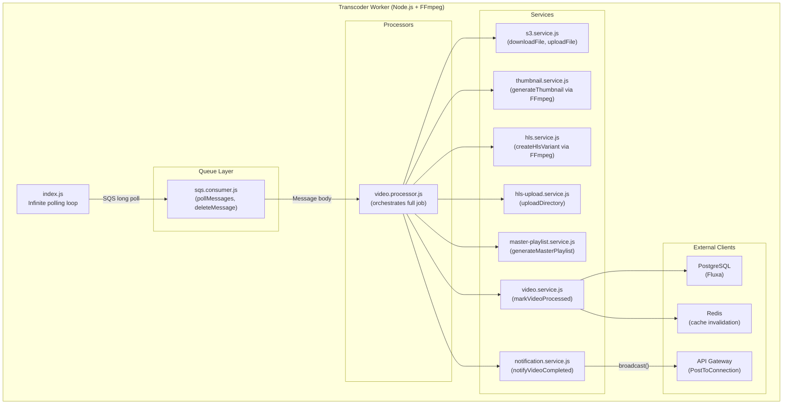
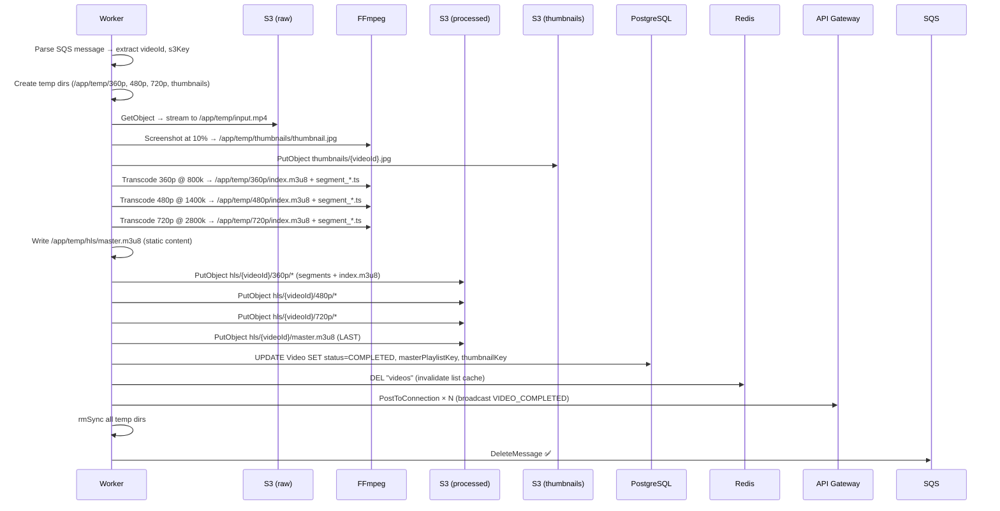
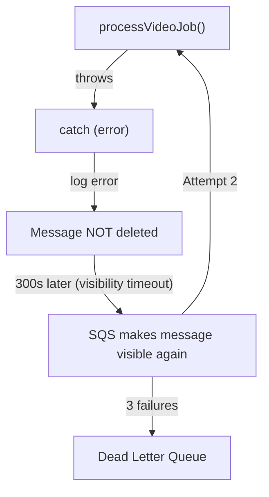

# Transcoder Worker

The transcoder worker is the compute heart of Flux. It is a standalone Node.js process that continuously polls an SQS queue, downloads raw uploaded videos from S3, runs FFmpeg to generate HLS adaptive streaming variants and thumbnails, uploads all artifacts back to S3, and notifies the system that processing is complete.

---

## Architecture



---

## Entry Point: Polling Loop

```js
// index.js
const startWorker = async () => {
  logger.info("Worker started");

  while (true) {
    try {
      const messages = await pollMessages();

      if (!messages.length) {
        await new Promise(resolve => setTimeout(resolve, 5000));
        continue;
      }

      await Promise.all(messages.map(async (message) => {
        const s3Event = JSON.parse(message.Body);
        const record = s3Event.Records[0];
        const s3Key = decodeURIComponent(record.s3.object.key);
        const fileName = s3Key.split("/").pop();
        const videoId = fileName.substring(0, 36);  // UUID is always 36 chars

        try {
          await processVideoJob({ videoId, fileName, s3Key });
          await deleteMessage(message.ReceiptHandle);
        } catch (error) {
          logger.error(error);
          // Message NOT deleted — will be retried or moved to DLQ
        }
      }));
    } catch (error) {
      logger.error(error);
    }
  }
};

process.on("SIGTERM", async () => {
  logger.info("Graceful shutdown initiated");
  process.exit(0);
});
```

**Key design points**:
- `Promise.all` on multiple messages allows parallel processing of up to N messages received in one poll (but in practice, one message at a time is typical)
- `deleteMessage` is called ONLY on success — failed messages stay in the queue
- `SIGTERM` handler allows Docker to gracefully stop the container

---

## SQS Consumer

```js
// queue/sqs.consumer.js
export const pollMessages = async () => {
  const command = new ReceiveMessageCommand({
    QueueUrl: process.env.SQS_QUEUE_URL,
    MaxNumberOfMessages: 10,      // batch up to 10
    WaitTimeSeconds: 20,          // long polling — reduces empty API calls
    VisibilityTimeout: 300,       // 5 minutes
  });
  const response = await sqsClient.send(command);
  return response.Messages || [];
};

export const deleteMessage = async (receiptHandle) => {
  const command = new DeleteMessageCommand({
    QueueUrl: process.env.SQS_QUEUE_URL,
    ReceiptHandle: receiptHandle,
  });
  await sqsClient.send(command);
};
```

**Long polling (WaitTimeSeconds=20)**: Instead of returning immediately when the queue is empty, SQS holds the request open for up to 20 seconds and returns as soon as a message arrives. This dramatically reduces API call overhead for idle queues.

---

## Full Processing Pipeline



---

## FFmpeg Workflow

### Thumbnail Generation

```js
function generateThumbnail(inputPath, outputPath) {
  return new Promise((resolve, reject) => {
    ffmpeg(inputPath)
      .screenshots({
        timestamps: ["10%"],         // Capture at 10% of video duration
        filename: "thumbnail.jpg",
        folder: outputPath,
        size: "640x360",             // Standard 16:9 SD resolution
      })
      .on("end", resolve)
      .on("error", reject);
  });
}
```

The thumbnail is a single JPEG frame extracted from 10% into the video. This avoids:
- Title cards / intro sequences (common in first 5%)
- Black frames or fade-ins

---

### HLS Variant Transcoding

```js
function createHlsVariant(inputPath, outputDir, height, bitrate) {
  return new Promise((resolve, reject) => {
    ffmpeg(inputPath)
      .videoCodec("libx264")          // H.264 codec
      .size(`?x${height}`)            // Preserve aspect ratio
      .outputOptions([
        `-b:v ${bitrate}`,            // Target bitrate
        "-preset ultrafast",          // Fastest encode (max speed, slightly larger files)
        "-profile:v main",            // H.264 Main profile (max compatibility)
        "-threads 0",                 // Use all CPU cores
        "-hls_time 6",               // 6-second HLS segments
        "-hls_playlist_type vod",    // VOD playlist type
        "-hls_list_size 0",          // Keep all segments in playlist
        "-sc_threshold 0",           // Disable scene change detection
        `-hls_segment_filename ${outputDir}/segment_%03d.ts`,
      ])
      .output(`${outputDir}/index.m3u8`)
      .on("end", resolve)
      .on("error", reject)
      .run();
  });
}
```

**Why `ultrafast` preset?** The `ultrafast` preset disables most encoder optimizations to minimize CPU cycles per frame. The tradeoff is ~15-30% larger output files compared to `medium` or `slow`, but transcoding is 3–5x faster. For a portfolio/development workload on a `t3.small`, speed is more valuable than optimal compression.

**Why sequential not parallel?** The three transcoding jobs run sequentially (`await createHlsVariant(...)`). This is because all three share the same 2 CPUs — parallel execution would cause CPU contention and likely result in slower total time than sequential execution. The `-threads 0` flag already maximizes CPU utilisation for each individual encode.

---

### Master Playlist Generation

```js
async function generateMasterPlaylist(outputPath) {
  const content = `#EXTM3U

#EXT-X-STREAM-INF:BANDWIDTH=800000,RESOLUTION=640x360
360p/index.m3u8

#EXT-X-STREAM-INF:BANDWIDTH=1400000,RESOLUTION=854x480
480p/index.m3u8

#EXT-X-STREAM-INF:BANDWIDTH=2800000,RESOLUTION=1280x720
720p/index.m3u8
`;
  fs.writeFileSync(outputPath, content);
}
```

This is a static, hardcoded master playlist. It correctly represents the three quality variants with their respective bandwidths (in bits/second) and resolutions. HLS.js uses the `BANDWIDTH` hint for initial stream selection.

**Future improvement**: Dynamically generate `BANDWIDTH` and resolution values by parsing the FFmpeg output stats to get actual encoded bitrates.

---

## S3 Upload

### Single File Upload

```js
const uploadFile = async (bucket, key, filePath, contentType) => {
  const fileStream = fs.createReadStream(filePath);
  const command = new PutObjectCommand({
    Bucket: bucket,
    Key: key,
    Body: fileStream,
    ContentType: contentType,
  });
  await s3Client.send(command);
};
```

### Directory Upload (for HLS variants)

```js
// hls-upload.service.js
export const uploadDirectory = async (localDir, s3Prefix) => {
  const files = fs.readdirSync(localDir);
  for (const file of files) {
    const localPath = path.join(localDir, file);
    const s3Key = `${s3Prefix}/${file}`;
    const contentType = file.endsWith(".m3u8")
      ? "application/x-mpegURL"
      : "video/MP2T";
    await uploadFile(process.env.PROCESSED_BUCKET_NAME, s3Key, localPath, contentType);
  }
};
```

Files are uploaded sequentially. The `content-type` is set correctly:
- `.m3u8` → `application/x-mpegURL` (HLS playlist MIME type)
- `.ts` → `video/MP2T` (MPEG-2 Transport Stream)

**Order matters**: The master playlist is uploaded LAST after all variant directories. This prevents HLS clients from fetching playlists before segments exist.

---

## Failure Handling



### Failure Scenarios

| Failure | Behaviour | Recovery |
|---|---|---|
| S3 download fails | Error thrown, message not deleted | SQS retry |
| FFmpeg crash | Error thrown, partial output left on disk | SQS retry — new scratch dirs created fresh |
| S3 upload fails | Error thrown mid-job | SQS retry — re-runs full job |
| DB update fails | Error thrown, S3 already uploaded | SQS retry — idempotent (overwrites same S3 keys) |
| WebSocket broadcast fails per-connection | Per-connection error caught, loop continues | Client falls back to polling |
| Worker container crashes | SQS visibility timeout expires → message redelivered | Docker restart policy + SQS retry |

### Idempotency

The processing pipeline is **effectively idempotent** because:
- S3 `PutObject` overwrites existing objects with the same key
- PostgreSQL `UPDATE` is idempotent (same values written again)
- Redis `DEL` is idempotent
- `PostToConnection` failures per-connection are non-fatal

If the same message is processed twice (e.g., parallel workers), the second run will simply overwrite identical data.

---

## Cleanup

After each job (success or failure from a previous partial run), all temp files are removed:

```js
const TEMP_DIRS = ["/app/temp/360p", "/app/temp/480p", "/app/temp/720p", "/app/temp/hls", "/app/temp/thumbnails"];
TEMP_DIRS.forEach(dir => {
  if (fs.existsSync(dir)) fs.rmSync(dir, { recursive: true, force: true });
});
if (fs.existsSync(inputPath)) fs.unlinkSync(inputPath);
```

Failure to clean up would result in disk exhaustion. A 50 MB input can produce:
- 360p: ~35 MB
- 480p: ~60 MB
- 720p: ~120 MB
- Input: 50 MB
- Total scratch space: ~265 MB per job

With a 30 GB EBS volume shared between all containers, 5 concurrent jobs could exhaust available space.

---

## Scaling Workers

The worker container can be horizontally scaled by increasing `deploy.replicas` in Docker Compose:

```yaml
transcoder-worker:
  deploy:
    replicas: 3   # Run 3 parallel workers
```

Each worker polls SQS independently. SQS visibility timeout (300s) ensures a message being processed by Worker A is hidden from Workers B and C. If Worker A crashes, the message becomes visible after 300s and Worker B picks it up.

**Scaling considerations**:
- Each worker uses 2 CPUs during FFmpeg transcoding → 3 workers would require a 6+ vCPU instance
- Each worker needs ~300 MB scratch space per job → ensure adequate EBS volume
- PostgreSQL connection pool: each worker opens a Fluxa connection → ensure DB can handle N concurrent connections
- Redis connections: each worker opens a Redis connection → minimal overhead

For production scaling, each worker should run on a **separate EC2 instance** (or Fargate task), each consuming from the same SQS queue.
