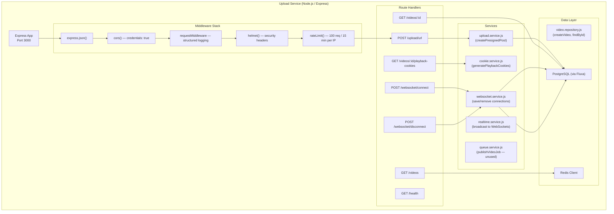
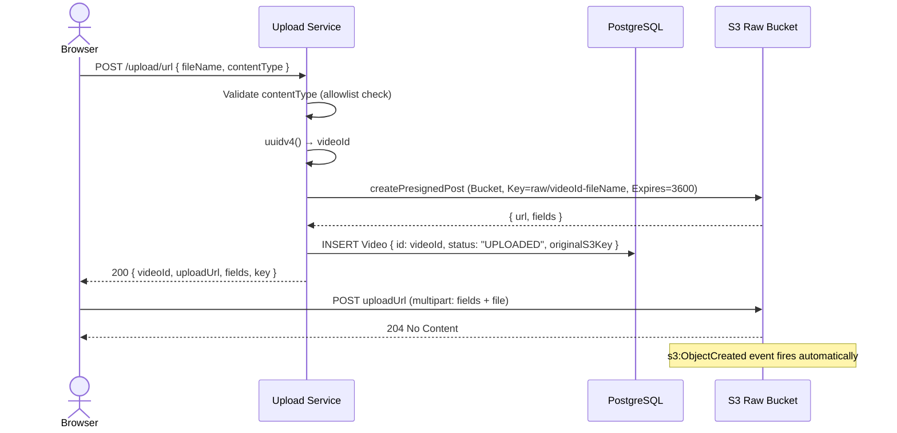

# Upload Service

This document provides a complete technical reference for the Flux Upload Service — the central REST API that handles video ingestion, metadata management, CloudFront cookie issuance, and WebSocket connection management.

---

## Architecture



---

## API Endpoints

### `POST /upload/url` — Generate Pre-signed Upload URL

**Purpose**: Returns a pre-signed S3 POST URL and form fields for the browser to upload a video file directly to S3.

**Validation**:
- `fileName`: required string
- `contentType`: must be one of `video/mp4`, `video/quicktime`, `video/x-msvideo`
- File size is enforced server-side via S3 condition (`content-length-range: 0–524288000`)

**Request**:
```http
POST /upload/url
Content-Type: application/json

{
  "fileName": "my-video.mp4",
  "contentType": "video/mp4"
}
```

**Response** `200 OK`:
```json
{
  "videoId": "a1b2c3d4-e5f6-7890-abcd-ef1234567890",
  "uploadUrl": "https://Flux-dev-masir-raw-videos.s3.ap-south-1.amazonaws.com/",
  "fields": {
    "key": "raw/a1b2c3d4-...-my-video.mp4",
    "Content-Type": "video/mp4",
    "Policy": "eyJleHBpcmF0aW9uIjoiMjAyNS0...",
    "X-Amz-Algorithm": "AWS4-HMAC-SHA256",
    "X-Amz-Credential": "ASIAXXX.../aws4_request",
    "X-Amz-Date": "20250610T120000Z",
    "X-Amz-Security-Token": "...",
    "X-Amz-Signature": "abc123..."
  },
  "key": "raw/a1b2c3d4-...-my-video.mp4"
}
```

**Error Responses**:

| Status | Body | Condition |
|---|---|---|
| `400` | `{ "message": "fileName and contentType required" }` | Missing fields |
| `400` | `{ "message": "Unsupported file type" }` | contentType not in allowlist |
| `500` | `{ "message": "Failed to generate upload URL" }` | AWS SDK error |

**Side effects**:
1. Creates a `Video` record in PostgreSQL with `status: "UPLOADED"`
2. Sets S3 key as `raw/{videoId}-{fileName}`
3. Pre-signed URL expires in 3,600 seconds (1 hour)

---

### `GET /videos` — List All Videos

**Purpose**: Returns all videos ordered by `createdAt` descending. Redis-cached for 60 seconds.

**Caching behaviour**:
```
Cache hit → return JSON from Redis (60s TTL)
Cache miss → query PostgreSQL → store in Redis → return JSON
```

**Response** `200 OK`:
```json
[
  {
    "id": "a1b2c3d4-...",
    "fileName": "my-video.mp4",
    "originalS3Key": "raw/a1b2c3d4-...-my-video.mp4",
    "status": "COMPLETED",
    "thumbnailUrl": "https://cdn.masir-projects.me/thumbnails/a1b2c3d4-....jpg",
    "masterPlaylistKey": "hls/a1b2c3d4-.../master.m3u8",
    "hlsMasterUrl": "hls/a1b2c3d4-.../360p/index.m3u8",
    "thumbnailKey": "thumbnails/a1b2c3d4-....jpg",
    "createdAt": "2025-06-10T12:00:00.000Z",
    "updatedAt": "2025-06-10T12:05:00.000Z"
  }
]
```

**Note**: `thumbnailUrl` is computed on-the-fly as `https://${CLOUDFRONT_DOMAIN}/${video.thumbnailKey}`. It is NOT stored in the database — only `thumbnailKey` is stored.

---

### `GET /videos/:id` — Fetch Single Video

**Purpose**: Returns a single video record with computed playback URLs.

**Response** `200 OK`:
```json
{
  "id": "a1b2c3d4-...",
  "fileName": "my-video.mp4",
  "status": "COMPLETED",
  "playbackUrl": "https://cdn.masir-projects.me/hls/a1b2c3d4-.../master.m3u8",
  "thumbnailUrl": "https://cdn.masir-projects.me/thumbnails/a1b2c3d4-....jpg",
  "masterPlaylistKey": "hls/a1b2c3d4-.../master.m3u8",
  "createdAt": "2025-06-10T12:00:00.000Z"
}
```

**Error Responses**:

| Status | Body | Condition |
|---|---|---|
| `404` | `{ "message": "Video not found" }` | No record with that ID |

---

### `GET /videos/:id/playback-cookies` — Issue CloudFront Signed Cookies

**Purpose**: Generates CloudFront signed cookies scoped to `hls/{videoId}/*` and sets them on the response. The browser automatically attaches these cookies to all subsequent CloudFront requests for the video's HLS assets.

**Preconditions**:
- Video must exist in the database
- Video status must be `COMPLETED` or `PROCESSED`
- CloudFront signing must be configured (private key + key pair ID)

**Cookie issuance**:
```js
const resourceUrl = `https://${CLOUDFRONT_DOMAIN}/hls/${videoId}/*`;
const expiry = Date.now() + COOKIE_EXPIRY_HOURS * 3600 * 1000;  // 2 hours
const cookies = getSignedCookies({ keyPairId, privateKey, policy: { Resource: resourceUrl, ... } });
```

**Response Headers**:
```
Set-Cookie: CloudFront-Policy=eyJTdGF0ZW...; Path=/; Secure; SameSite=None; Max-Age=7200; Domain=.masir-projects.me
Set-Cookie: CloudFront-Signature=abc123...; Path=/; Secure; SameSite=None; Max-Age=7200; Domain=.masir-projects.me
Set-Cookie: CloudFront-Key-Pair-Id=APKAIEXAMPLE; Path=/; Secure; SameSite=None; Max-Age=7200; Domain=.masir-projects.me
```

**Response Body** `200 OK`:
```json
{
  "message": "Cookies set",
  "cloudfrontDomain": "cdn.masir-projects.me",
  "videoId": "a1b2c3d4-..."
}
```

**Error Responses**:

| Status | Body | Condition |
|---|---|---|
| `404` | `{ "message": "Video not found" }` | Video doesn't exist |
| `400` | `{ "message": "Video is not ready for playback" }` | Status is UPLOADED (still transcoding) |
| `500` | `{ "message": "Failed to generate playback cookies" }` | CloudFront not configured / key missing |

---

### `POST /websocket/connect` — Register WebSocket Connection

**Purpose**: Called by API Gateway when a browser establishes a WebSocket connection. Stores the `connectionId` in PostgreSQL.

**How the connectionId arrives**: API Gateway forwards `context.connectionId` as the `x-connection-id` request header (configured in Terraform WebSocket integration).

**Request** (from API Gateway):
```http
POST /websocket/connect
x-connection-id: Abc123XyZ==

{}
```

**Response** `200 OK`:
```json
{ "success": true }
```

---

### `POST /websocket/disconnect` — Remove WebSocket Connection

**Purpose**: Called by API Gateway when a browser closes its WebSocket connection.

**Response** `200 OK`:
```json
{ "success": true }
```

---

### `GET /health` — Health Check

**Purpose**: Used by Docker Compose healthcheck to determine if the service is up.

**Response** `200 OK`:
```json
{ "status": "healthy" }
```

---

## Upload Flow



---

## Pre-signed URL Deep Dive

The pre-signed POST is generated using the `@aws-sdk/s3-presigned-post` SDK:

```js
const { url, fields } = await createPresignedPost(s3Client, {
  Bucket: process.env.RAW_BUCKET_NAME,
  Key: `raw/${videoId}-${fileName}`,
  Conditions: [
    ["content-length-range", 0, 524288000],   // 0 to 500 MB
    ["eq", "$Content-Type", contentType],     // Enforce declared content type
  ],
  Fields: {
    "Content-Type": contentType,
  },
  Expires: 3600,  // URL expires in 1 hour
});
```

**Conditions are enforced by S3**, not the client:
- If the browser uploads a 600 MB file, S3 will reject it with `EntityTooLarge`
- If the browser changes the content type, S3 will reject it with `SignatureDoesNotMatch`
- After 1 hour, S3 will reject the URL with `ExpiredToken`

**Browser upload** (multipart form):
```js
const formData = new FormData();
Object.entries(fields).forEach(([key, value]) => formData.append(key, value));
formData.append("file", selectedFile);  // file must be LAST in FormData
await fetch(uploadUrl, { method: "POST", body: formData });
```

---

## Database Interactions

### Video Record Lifecycle

| Event | Action | Fields Changed |
|---|---|---|
| `POST /upload/url` | `INSERT Video` | `id`, `fileName`, `originalS3Key`, `status="UPLOADED"` |
| Worker completes | `UPDATE Video` | `status="COMPLETED"`, `masterPlaylistKey`, `thumbnailKey`, `hlsMasterUrl` |

### Connection Management

| Event | Action |
|---|---|
| Browser WebSocket connect | `INSERT WebSocketConnection { id: connectionId }` |
| Browser WebSocket disconnect | `DELETE WebSocketConnection WHERE id = connectionId` |
| Worker broadcasts | `SELECT * FROM WebSocketConnection` |

---

## Error Handling

The upload service uses a centralized `errorMiddleware`:

```js
app.use((err, req, res, next) => {
  logger.error(err);
  res.status(err.status || 500).json({
    message: err.message || "Internal server error",
  });
});
```

Individual route handlers catch errors and return appropriate HTTP status codes. Uncaught errors bubble up to the global error handler.

---

## Middleware Details

### Request Logging

Every request is logged with structured JSON including method, path, status, and duration. This feeds into CloudWatch log ingestion via Docker log forwarding.

### CORS Configuration

```js
app.use(cors({
  origin: true,        // Echo the request Origin header (allows any origin)
  credentials: true,  // Allow cookies (required for signed cookie playback)
  methods: ["GET", "POST", "PUT"],
}))
```

**Note**: `origin: true` reflects the request origin, which is effectively equivalent to `*` but also enables credentialed requests. In production, this should be restricted to the specific frontend domain.

### Helmet Security Headers

Helmet automatically sets:
- `X-DNS-Prefetch-Control: off`
- `X-Frame-Options: SAMEORIGIN`
- `X-Content-Type-Options: nosniff`
- `Referrer-Policy: no-referrer`
- And 10+ other headers
