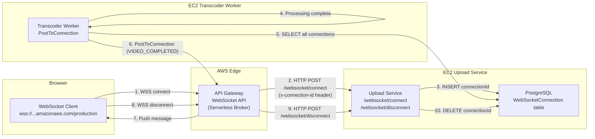
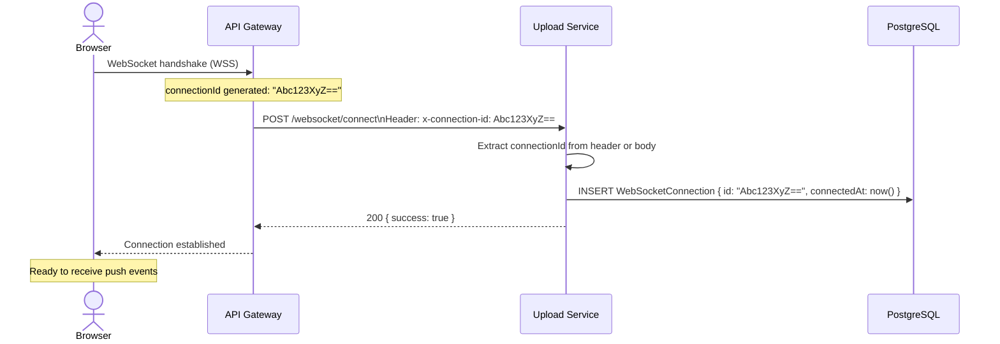
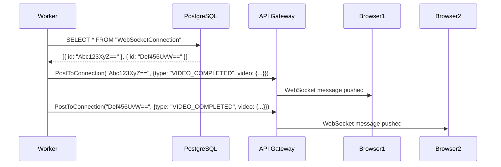
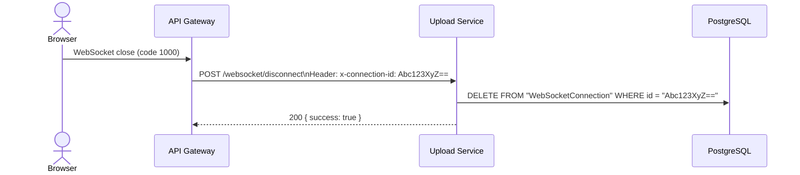

# WebSocket Flow

This document explains the real-time communication architecture in Flux — how browsers receive live transcoding status updates via AWS API Gateway WebSocket without polling.

---

## Overview

Flux uses **AWS API Gateway WebSocket API** as a serverless WebSocket broker. The broker routes connection lifecycle events (`$connect`, `$disconnect`) to the Upload Service REST API via HTTP. The Upload Service stores connection IDs in PostgreSQL. When the Transcoder Worker completes processing, it uses the API Gateway Management API to push `VIDEO_COMPLETED` events to all connected browsers.

---

## Architecture



---

## WebSocket Lifecycle

### Phase 1: Connection Establishment



**Connection ID routing**: Terraform configures the API Gateway integration to forward `context.connectionId` as the `x-connection-id` header:

```hcl
request_parameters = {
  "integration.request.header.x-connection-id" = "context.connectionId"
}
```

The Upload Service extracts it with:
```js
const connectionId =
  req.body.connectionId ||
  req.body.requestContext?.connectionId ||
  req.headers["x-connection-id"];   // Primary path for API GW HTTP_PROXY integration
```

---

### Phase 2: Event Broadcasting

When the Transcoder Worker completes processing:



**Broadcast implementation**:
```js
async function broadcast(payload) {
  const connections = await Fluxa.webSocketConnection.findMany();

  for (const connection of connections) {
    try {
      await client.send(new PostToConnectionCommand({
        ConnectionId: connection.id,
        Data: Buffer.from(JSON.stringify(payload)),
      }));
    } catch (error) {
      logger.error(error);  // Per-connection failure — loop continues
    }
  }
}
```

**Event payload**:
```json
{
  "type": "VIDEO_COMPLETED",
  "video": {
    "id": "a1b2c3d4-...",
    "status": "COMPLETED"
  }
}
```

**Frontend handler** (Next.js):
```js
ws.onmessage = (event) => {
  const { type, video } = JSON.parse(event.data);
  if (type === "VIDEO_COMPLETED") {
    // Refetch video details and trigger playback cookie fetch
    fetchVideoAndSetupPlayback(video.id);
  }
};
```

---

### Phase 3: Disconnection



---

## API Gateway Configuration

### Terraform Resources

```hcl
# WebSocket API
resource "aws_apigatewayv2_api" "websocket_api" {
  name                       = "${var.project_name}-${var.environment}-websocket"
  protocol_type              = "WEBSOCKET"
  route_selection_expression = "$request.body.action"  # Route key from message body
}

# Production stage (auto-deployed)
resource "aws_apigatewayv2_stage" "websocket_stage" {
  api_id      = aws_apigatewayv2_api.websocket_api.id
  name        = "production"
  auto_deploy = true
}

# Connect integration → Upload Service
resource "aws_apigatewayv2_integration" "connect_integration" {
  integration_type   = "HTTP_PROXY"
  integration_uri    = "https://video-processing-api.masir-projects.me/websocket/connect"
  integration_method = "POST"
  request_parameters = {
    "integration.request.header.x-connection-id" = "context.connectionId"
  }
}
```

### Endpoint Format

```
wss://{api-id}.execute-api.ap-south-1.amazonaws.com/production
```

The management API endpoint (for `PostToConnection`) uses HTTPS:
```
https://{api-id}.execute-api.ap-south-1.amazonaws.com/production
```

---

## Connection Management

### Persistence Strategy

Connection IDs are stored in PostgreSQL (`WebSocketConnection` table) rather than Redis. This choice provides durability — if the Upload Service restarts, connections are not lost (though browsers would need to reconnect anyway due to the WebSocket disconnect).

**Alternative considered**: Redis Set for connection IDs (faster reads for broadcast). Rejected because:
- PostgreSQL is already a dependency; adding Redis for this use case adds complexity without significant benefit at low connection counts
- PostgreSQL reads for `findMany()` on a small table (< 1,000 connections) are sub-millisecond

### Connection Lifecycle Edge Cases

| Scenario | Behaviour |
|---|---|
| Browser closes tab without proper disconnect | API GW fires `$disconnect` automatically — connection cleaned up |
| EC2 restarts while browser is connected | API GW holds connections; first `PostToConnection` returns `GoneException` — connection stays as stale DB row |
| Worker tries to PostToConnection to stale ID | `GoneException` thrown → caught in per-connection try/catch → logged → continues |
| Multiple browsers watching same video | All receive `VIDEO_COMPLETED` event — each browser independently requests cookies |

### Stale Connection Cleanup

Currently, stale connections are NOT automatically removed. If a browser's tab crashes (no proper WebSocket close), the connection record remains in PostgreSQL indefinitely. This could accumulate stale rows over time.

**Recommended cleanup**: Add a cron job or periodic sweep to remove connections older than N hours (assuming typical browser session length):

```js
// Weekly cleanup job (example)
await Fluxa.webSocketConnection.deleteMany({
  where: {
    connectedAt: {
      lt: new Date(Date.now() - 7 * 24 * 60 * 60 * 1000),
    },
  },
});
```

---

## Failure Recovery

### Worker Cannot Reach API Gateway

If the API Gateway management endpoint is unreachable or the worker's IAM role doesn't have `execute-api:ManageConnections` permission:

- `PostToConnection` throws an error
- Error is caught and logged
- Browser does NOT receive the event
- Browser falls back to polling `GET /videos/:id` every 7 seconds (implemented in frontend)

### Browser Reconnection

The frontend should implement exponential backoff WebSocket reconnection:

```js
let ws;
let reconnectDelay = 1000;

function connectWebSocket() {
  ws = new WebSocket(process.env.NEXT_PUBLIC_WEBSOCKET_URL);

  ws.onopen = () => { reconnectDelay = 1000; };  // Reset on success

  ws.onclose = () => {
    setTimeout(() => {
      reconnectDelay = Math.min(reconnectDelay * 2, 30000);
      connectWebSocket();
    }, reconnectDelay);
  };

  ws.onmessage = handleMessage;
}
```

---

## Security Considerations

| Concern | Analysis | Mitigation |
|---|---|---|
| Unauthenticated WebSocket connections | Any client can connect to the WSS endpoint | Currently acceptable for portfolio; add JWT/API key auth for production |
| All browsers receive all VIDEO_COMPLETED events | No per-user scoping | Acceptable for a shared library; add user ID matching if multi-tenant |
| `x-connection-id` header spoofing | API GW sets the header — client cannot override it | Secure; the header is injected by the integration, not the browser |
| Stale connection DDoS via broadcast | Many stale rows cause slow `PostToConnection` loops | Implement stale connection cleanup (see above) |

---

## Future Enhancements

1. **WebSocket Authentication**: Add a JWT or session token validation step in the `$connect` handler before allowing the connection to be registered.

2. **Per-Video Subscriptions**: Instead of broadcasting to all connections, clients could subscribe to specific video IDs. The worker would then `PostToConnection` only to subscribers of the completed video.

3. **Progress Events**: Send intermediate progress events (`THUMBNAIL_GENERATED`, `360P_COMPLETE`, etc.) during processing for more granular UI feedback.

4. **Multiple Message Types**:
   ```json
   { "type": "VIDEO_UPLOAD_STARTED", "videoId": "..." }
   { "type": "VIDEO_PROCESSING_STARTED", "videoId": "..." }
   { "type": "VIDEO_THUMBNAIL_READY", "videoId": "...", "thumbnailUrl": "..." }
   { "type": "VIDEO_COMPLETED", "videoId": "...", "playbackUrl": "..." }
   { "type": "VIDEO_FAILED", "videoId": "...", "error": "..." }
   ```

5. **SNS Fan-out**: Replace direct `PostToConnection` with SNS → Lambda → `PostToConnection` to decouple the worker from WebSocket infrastructure.
