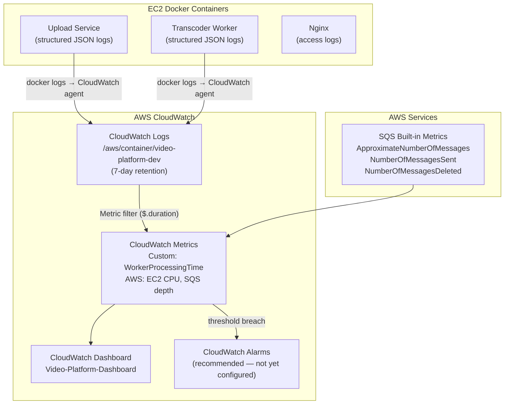

# Monitoring & Observability

This document describes how Flux is monitored in production — CloudWatch dashboards, custom metrics, log analysis, and alerting recommendations.

---

## Observability Architecture



---

## CloudWatch Dashboard

The Terraform-provisioned dashboard (`Video-Platform-Dashboard`) contains 6 widgets:

### Widget 1: EC2 CPU Utilization
```
Metric: AWS/EC2 → CPUUtilization
Instance: {app_server_id}
Period: 5 minutes
Stat: Average
```

**What to look for**: During FFmpeg transcoding, CPU should spike to ~85–100%. Sustained >90% without a job running indicates another process consuming CPU (possibly a memory-constrained Redis or PostgreSQL swap).

---

### Widget 2: EC2 Memory Usage
```
Metric: CWAgent → mem_used_percent
Instance: {app_server_id}
Period: 5 minutes
Stat: Average
```

Requires the CloudWatch Agent to be installed and configured. The `CloudWatchAgentServerPolicy` is attached to the EC2 role but the agent itself must be started on the instance.

**Install and start CloudWatch Agent**:
```bash
sudo apt install -y amazon-cloudwatch-agent
sudo /opt/aws/amazon-cloudwatch-agent/bin/amazon-cloudwatch-agent-config-wizard
sudo systemctl start amazon-cloudwatch-agent
sudo systemctl enable amazon-cloudwatch-agent
```

**Minimum config** (`/opt/aws/amazon-cloudwatch-agent/bin/config.json`):
```json
{
  "metrics": {
    "metrics_collected": {
      "mem": { "measurement": ["mem_used_percent"], "metrics_collection_interval": 60 }
    }
  }
}
```

---

### Widget 3: SQS Queue Depth
```
Metric: AWS/SQS → ApproximateNumberOfMessagesVisible
QueueName: Flux-dev-video-processing
Period: 1 minute
Stat: Average
```

**What to look for**: Messages visible > 0 means jobs are waiting. If queue depth grows without decreasing, the worker is stuck or not running.

---

### Widget 4: DLQ Messages
```
Metric: AWS/SQS → ApproximateNumberOfMessagesVisible
QueueName: Flux-dev-dlq
Period: 1 minute
Stat: Sum
```

**What to look for**: Any messages in the DLQ indicate processing failures. Each DLQ message represents a video that failed 3 processing attempts.

---

### Widget 5: Worker Processing Time (Custom Metric)
```
Namespace: VideoProcessingPlatform
Metric: WorkerProcessingTime
Period: 5 minutes
Stat: Average + p95
```

**Metric filter** (from Terraform):
```
filterPattern: { $.duration = * }
metricValue: $.duration
metricName: WorkerProcessingTime
namespace: VideoProcessingPlatform
```

The worker should log processing duration in JSON:
```js
const startTime = Date.now();
await processVideoJob({ videoId, ... });
const duration = Date.now() - startTime;
logger.info({ duration, videoId, msg: "Video processing completed" });
```

**What to look for**: Average should be < 180,000ms (3 minutes) for typical 50 MB videos. p95 > 600,000ms (10 minutes) indicates large videos or CPU throttling.

---

### Widget 6: Upload Volume
```
Metric: AWS/SQS → NumberOfMessagesSent
QueueName: Flux-dev-video-processing
Period: 1 hour
Stat: Sum
```

Tracks upload volume over time. Each message corresponds to one video uploaded to S3.

---

## Log Analysis

### Log Group Structure

All container stdout/stderr is collected in a single CloudWatch Log Group:
```
/aws/container/video-platform-dev
```

Individual log streams are created per container.

### Useful CloudWatch Insights Queries

**Find all failed video jobs in the last 24 hours**:
```sql
fields @timestamp, videoId, @message
| filter level = "error"
| filter @message like /processVideoJob/
| sort @timestamp desc
| limit 50
```

**Average processing time per hour**:
```sql
fields @timestamp, duration
| filter duration > 0
| stats avg(duration) as avgMs, count() as count by bin(1h)
| sort @timestamp asc
```

**Find slow transcoding jobs (>5 minutes)**:
```sql
fields @timestamp, videoId, duration
| filter duration > 300000
| sort duration desc
| limit 20
```

**Count videos by status change**:
```sql
fields @timestamp, @message
| filter @message like /COMPLETED/
| stats count() by bin(1d)
```

**Nginx 5xx errors**:
```sql
fields @timestamp, @message
| filter @message like / 5[0-9][0-9] /
| sort @timestamp desc
| limit 50
```

---

## Alerting (Recommended — Not Yet Configured)

### Alert 1: DLQ Message Count > 0

```hcl
resource "aws_cloudwatch_metric_alarm" "dlq_not_empty" {
  alarm_name          = "Flux-dlq-messages-present"
  comparison_operator = "GreaterThanThreshold"
  evaluation_periods  = 1
  metric_name         = "ApproximateNumberOfMessagesVisible"
  namespace           = "AWS/SQS"
  period              = 300
  statistic           = "Sum"
  threshold           = 0
  alarm_description   = "DLQ has messages — video processing is failing"
  dimensions          = { QueueName = "Flux-dev-dlq" }

  alarm_actions = [aws_sns_topic.alerts.arn]
}
```

### Alert 2: Worker Processing Time > 10 Minutes

```hcl
resource "aws_cloudwatch_metric_alarm" "slow_worker" {
  alarm_name          = "Flux-worker-slow-processing"
  comparison_operator = "GreaterThanThreshold"
  evaluation_periods  = 3
  metric_name         = "WorkerProcessingTime"
  namespace           = "VideoProcessingPlatform"
  period              = 300
  statistic           = "p95"
  threshold           = 600000  # 10 minutes in ms
  alarm_description   = "Worker p95 processing time exceeded 10 minutes"
}
```

### Alert 3: EC2 CPU > 90% for 30 minutes

```hcl
resource "aws_cloudwatch_metric_alarm" "high_cpu" {
  alarm_name          = "Flux-high-cpu"
  comparison_operator = "GreaterThanThreshold"
  evaluation_periods  = 6   # 6 × 5 minutes = 30 minutes
  metric_name         = "CPUUtilization"
  namespace           = "AWS/EC2"
  period              = 300
  statistic           = "Average"
  threshold           = 90
  dimensions          = { InstanceId = aws_instance.app_server.id }
}
```

### Alert 4: SQS Queue Depth > 10 for 15 minutes

Indicates worker is not keeping up with upload volume:

```hcl
resource "aws_cloudwatch_metric_alarm" "queue_depth" {
  alarm_name          = "Flux-queue-backlog"
  comparison_operator = "GreaterThanThreshold"
  evaluation_periods  = 3
  metric_name         = "ApproximateNumberOfMessagesVisible"
  namespace           = "AWS/SQS"
  period              = 300
  statistic           = "Average"
  threshold           = 10
  dimensions          = { QueueName = "Flux-dev-video-processing" }
}
```

---

## Health Check Endpoints

| Endpoint | Method | Expected Response |
|---|---|---|
| `https://video-processing-api.masir-projects.me/health` | GET | `{"status":"healthy"}` 200 |
| `https://video-processing.masir-projects.me` | GET | HTML 200 |
| `https://cdn.masir-projects.me` | GET | CloudFront 403 (expected — no signed cookie) |

**External health monitoring** (recommended): Use an external service (e.g., Uptime Robot, Pingdom, Better Uptime) to ping `/health` every minute from outside AWS. This detects EC2 failures, DNS issues, and Nginx crashes that internal monitoring may not catch.

---

## Structured Logging

Both the Upload Service and Transcoder Worker use structured JSON logging via a Logger (built on `winston` or similar):

```json
{"level":"info","msg":"Video processing started","videoId":"a1b2c3d4-...","s3Key":"raw/a1b2c3d4-...","timestamp":"2025-06-10T12:00:00.000Z"}
{"level":"info","msg":"Thumbnail generated","videoId":"a1b2c3d4-...","thumbnailKey":"thumbnails/a1b2c3d4-....jpg"}
{"level":"info","msg":"HLS transcoding completed","videoId":"a1b2c3d4-...","variant":"360p","duration":45231}
{"level":"info","msg":"Video processing completed","videoId":"a1b2c3d4-...","duration":187432,"timestamp":"2025-06-10T12:03:07.432Z"}
```

**Benefits of structured logging**:
- CloudWatch Insights can parse JSON fields natively
- Easy to filter by `videoId` to trace a single video's lifecycle
- Duration field enables the `WorkerProcessingTime` metric filter
- Level field enables error-rate dashboards

---

## Performance Benchmarks

| Metric | Observed (t3.small) | Target |
|---|---|---|
| API response time (`GET /videos`) | ~5ms (cache hit), ~50ms (DB) | < 200ms |
| Presigned URL generation | ~150-300ms (AWS SDK) | < 500ms |
| Thumbnail generation (50 MB video) | ~8-15 seconds | < 30 seconds |
| FFmpeg 360p transcode (50 MB) | ~45-90 seconds | < 3 minutes |
| FFmpeg 720p transcode (50 MB) | ~60-120 seconds | < 5 minutes |
| Total processing (50 MB) | ~3-5 minutes | < 10 minutes |
| S3 upload time (300 segments) | ~20-30 seconds | < 60 seconds |
| WebSocket push latency | < 100ms | < 500ms |
