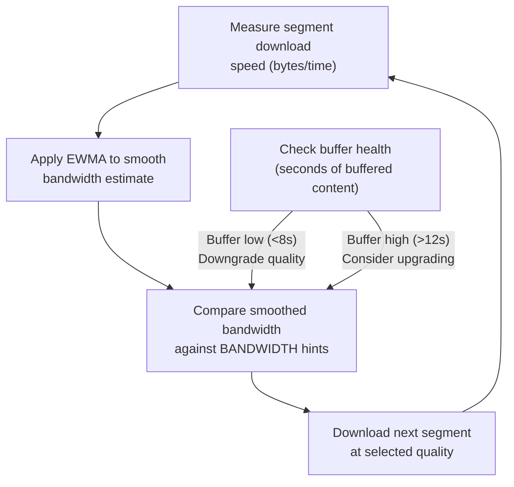
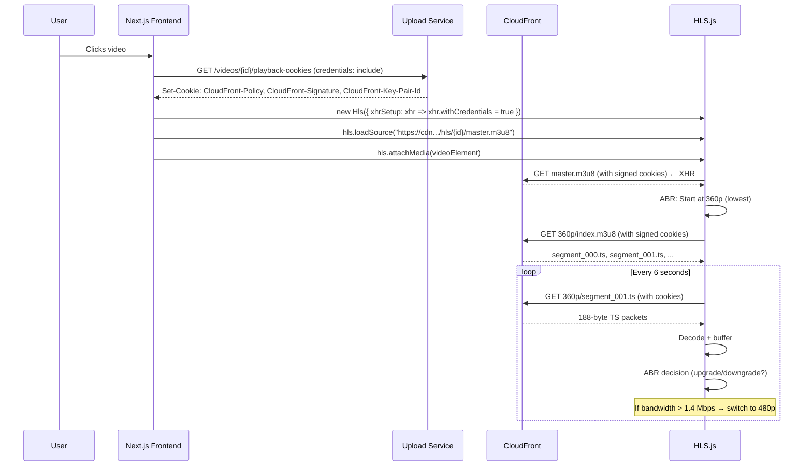

# HLS & Adaptive Streaming

This document explains the HLS (HTTP Live Streaming) standard as implemented in Flux — how videos are segmented, how adaptive bitrate selection works, how signed cookies protect segments, and what the frontend player does with the manifest.

---

## What is HLS?

HLS is Apple's HTTP-based streaming protocol, now an industry standard supported by all modern browsers and devices. It works by:

1. Splitting video into short `.ts` (MPEG-2 Transport Stream) segments
2. Creating a **playlist** (`.m3u8`) that lists the segments in order
3. Optionally, creating a **master playlist** that lists multiple quality variants
4. The client downloads and plays segments sequentially, switching quality adaptively

HLS is a pull-based protocol — the client requests each segment independently over standard HTTP. There is no persistent connection required (unlike WebRTC or RTMP).

---

## HLS Playlist Types in Flux

Flux uses `#EXT-X-PLAYLIST-TYPE:VOD` (Video on Demand):

| Playlist Type | Behaviour | Used For |
|---|---|---|
| `VOD` | All segments listed; `#EXT-X-ENDLIST` included | Pre-recorded videos (Flux) |
| `LIVE` | Sliding window of segments; client re-fetches playlist | Live streams |
| `EVENT` | Segments accumulate; can seek to beginning | Live events with DVR |

The `VOD` type allows full seeking, pause, and resume from any position.

---

## Flux HLS Manifest Structure

```
hls/{videoId}/
├── master.m3u8          ← Master playlist (references variant playlists)
├── 360p/
│   ├── index.m3u8       ← 360p variant playlist
│   ├── segment_000.ts   ← First 6-second segment
│   ├── segment_001.ts
│   ├── segment_002.ts
│   └── ...
├── 480p/
│   ├── index.m3u8
│   └── segment_*.ts
└── 720p/
    ├── index.m3u8
    └── segment_*.ts
```

---

## Master Playlist (master.m3u8)

```m3u8
#EXTM3U

#EXT-X-STREAM-INF:BANDWIDTH=800000,RESOLUTION=640x360
360p/index.m3u8

#EXT-X-STREAM-INF:BANDWIDTH=1400000,RESOLUTION=854x480
480p/index.m3u8

#EXT-X-STREAM-INF:BANDWIDTH=2800000,RESOLUTION=1280x720
720p/index.m3u8
```

### Parsing the Master Playlist

| Tag | Value | Meaning |
|---|---|---|
| `#EXTM3U` | — | Required header for all M3U8 files |
| `#EXT-X-STREAM-INF` | Attributes + URI | Declares a quality variant |
| `BANDWIDTH=800000` | 800,000 bps = 800 Kbps | Declared bandwidth for ABR decisions |
| `RESOLUTION=640x360` | Width × Height | Pixel dimensions of the stream |
| `360p/index.m3u8` | Relative path | URI of the variant playlist (relative to master) |

---

## Variant Playlist (360p/index.m3u8)

```m3u8
#EXTM3U
#EXT-X-VERSION:3
#EXT-X-TARGETDURATION:6
#EXT-X-MEDIA-SEQUENCE:0
#EXT-X-PLAYLIST-TYPE:VOD

#EXTINF:6.006,
segment_000.ts

#EXTINF:6.006,
segment_001.ts

#EXTINF:5.839,
segment_002.ts

#EXT-X-ENDLIST
```

| Tag | Value | Meaning |
|---|---|---|
| `#EXT-X-VERSION:3` | 3 | HLS protocol version |
| `#EXT-X-TARGETDURATION:6` | 6 | Maximum segment duration in seconds |
| `#EXT-X-MEDIA-SEQUENCE:0` | 0 | Sequence number of first segment |
| `#EXT-X-PLAYLIST-TYPE:VOD` | VOD | Client won't re-request this playlist (all segments known) |
| `#EXTINF:6.006,` | 6.006s | Duration of the following segment |
| `segment_000.ts` | Filename | Relative URI of the segment file |
| `#EXT-X-ENDLIST` | — | No more segments will be added |

**Segment naming**: FFmpeg generates `segment_000.ts`, `segment_001.ts`, etc. using `-hls_segment_filename segment_%03d.ts`. The `%03d` format ensures lexicographic ordering (e.g., `segment_009.ts` comes before `segment_010.ts`).

---

## Adaptive Bitrate (ABR) Algorithm

HLS.js implements ABR using the **EWMA** (Exponentially Weighted Moving Average) algorithm:



**ABR Decision Rules in HLS.js**:
1. **Initial level**: Based on declared BANDWIDTH vs estimated throughput. HLS.js starts with the lowest quality to build the initial buffer quickly.
2. **Level switch up**: When the buffer is sufficiently healthy (>12s) and bandwidth estimate comfortably exceeds the next level's BANDWIDTH.
3. **Level switch down**: When bandwidth drops, or when a segment download stalls.
4. **Emergency drop**: If the buffer empties completely, immediately switch to the lowest quality.

---

## Segment Duration Selection

Flux uses **6-second segments** (`-hls_time 6`).

| Segment Duration | Pros | Cons |
|---|---|---|
| 2 seconds | Low seek latency, fast ABR adaptation | More HTTP requests, higher server load |
| 6 seconds | Good balance, industry default | 6-second "granularity" for quality switches |
| 10 seconds | Fewer requests, good for CDN caching | Slow ABR adaptation, higher initial buffer time |

**Seek latency**: When the user seeks, the player must download the segment containing the seek position. With 6-second segments, the maximum seek overhead is 6 seconds of data.

---

## HLS Segment Transport

Each `.ts` file is an **MPEG-2 Transport Stream** container holding:
- H.264 video (encoded by FFmpeg with `libx264`)
- AAC audio (if audio is present in the source)
- PAT/PMT tables (MPEG-2 TS metadata)

The transport stream format is designed for unreliable transmission — it can be decoded starting from any byte boundary (each 188-byte packet is independent).

---

## CloudFront and Signed Cookies for HLS

### Why Signed Cookies Are Essential for HLS

Consider a 10-minute video with 6-second segments:
- 10 minutes = 600 seconds
- 600 / 6 = 100 segments per quality level
- 3 quality levels × 100 segments = 300 `.ts` files
- Plus 1 master playlist + 3 variant playlists = **304 CloudFront requests per video session**

Generating a signed URL for each segment reference in the `.m3u8` playlist is impractical. Signed cookies cover all 304 requests with a single authentication event.

### Cookie Scope

```
https://cdn.masir-projects.me/hls/{videoId}/*
```

The wildcard `/*` matches:
- `hls/{videoId}/master.m3u8` ✅
- `hls/{videoId}/360p/index.m3u8` ✅
- `hls/{videoId}/360p/segment_000.ts` ✅
- `hls/{videoId}/720p/segment_099.ts` ✅
- `hls/{videoId2}/master.m3u8` ❌ (different video — separate cookie set required)

Each video requires its own playback cookie request scoped to its `videoId`. This prevents cross-video access.

### HLS.js Cookie Configuration

```js
const hls = new Hls({
  xhrSetup: (xhr) => {
    xhr.withCredentials = true;  // Send cookies with all HLS requests
  },
});
```

The `withCredentials: true` flag is essential — without it, the browser sends CORS requests without cookies, and CloudFront returns 403.

---

## CORS and HLS Playback

HLS.js makes **cross-origin** requests (from `video-processing.masir-projects.me` to `cdn.masir-projects.me`). This requires:

**CloudFront Response Headers Policy**:
```
Access-Control-Allow-Origin: https://video-processing.masir-projects.me
Access-Control-Allow-Credentials: true
Access-Control-Allow-Methods: GET, HEAD, OPTIONS
Access-Control-Allow-Headers: Origin, Accept, Content-Type, Authorization, Range
```

**Critical**: `Access-Control-Allow-Credentials: true` CANNOT be combined with `Access-Control-Allow-Origin: *`. A specific origin must be declared. This is why the Terraform CloudFront `cors_policy` explicitly lists the frontend domain.

**`Range` header**: HLS.js sends `Range` requests for partial segment downloads. The `Range` header must be in `Access-Control-Allow-Headers`.

---

## Frontend HLS Player Implementation



---

## Video Quality Statistics

The Flux frontend includes a **Stats for Nerds** overlay that shows:
- Current quality level and resolution
- Current bitrate (measured, not declared)
- Buffer duration in seconds
- Dropped frames count
- ABR state (stable/switching)

This is implemented by listening to HLS.js events:
```js
hls.on(Hls.Events.LEVEL_SWITCHED, (event, data) => {
  setCurrentLevel(data.level);
});

hls.on(Hls.Events.FRAG_LOADED, (event, data) => {
  setBitrate(data.stats.bwEstimate);
});

hls.on(Hls.Events.BUFFER_APPENDED, () => {
  setBufferLength(hls.mainForwardBufferInfo?.len || 0);
});
```

---

## Manifest Inspector

The Flux **Manifest Inspector** (a developer tool in the Video Detail page) allows real-time inspection of live HLS playlists fetched directly from CloudFront:

- Fetches `master.m3u8` and displays it with syntax highlighting
- Lazy-loads variant playlists on demand
- Displays segment-level timing information
- Shows raw M3U8 content alongside a parsed representation

This is implemented as a React component (`ManifestInspector.jsx`) that uses the `fetch` API with `credentials: "include"` to retrieve playlists through the signed cookies already set in the browser.

---

## Playback Compatibility

| Platform | HLS Support | Notes |
|---|---|---|
| Safari (macOS/iOS) | Native | No HLS.js required; Safari's MSE handles HLS natively |
| Chrome (desktop) | HLS.js | Excellent ABR support |
| Firefox (desktop) | HLS.js | Good performance |
| Edge (Chromium) | HLS.js | Same as Chrome |
| Android Chrome | HLS.js | Works well on modern Android |
| IE 11 | None | Not supported (EOL) |

**Safari note**: Safari uses its native HLS implementation which doesn't support `withCredentials` in the same way for `<video src>` tags. For cross-origin signed cookie playback in Safari, a dedicated CloudFront domain matching the page origin (or server-side proxying) is recommended for production.
