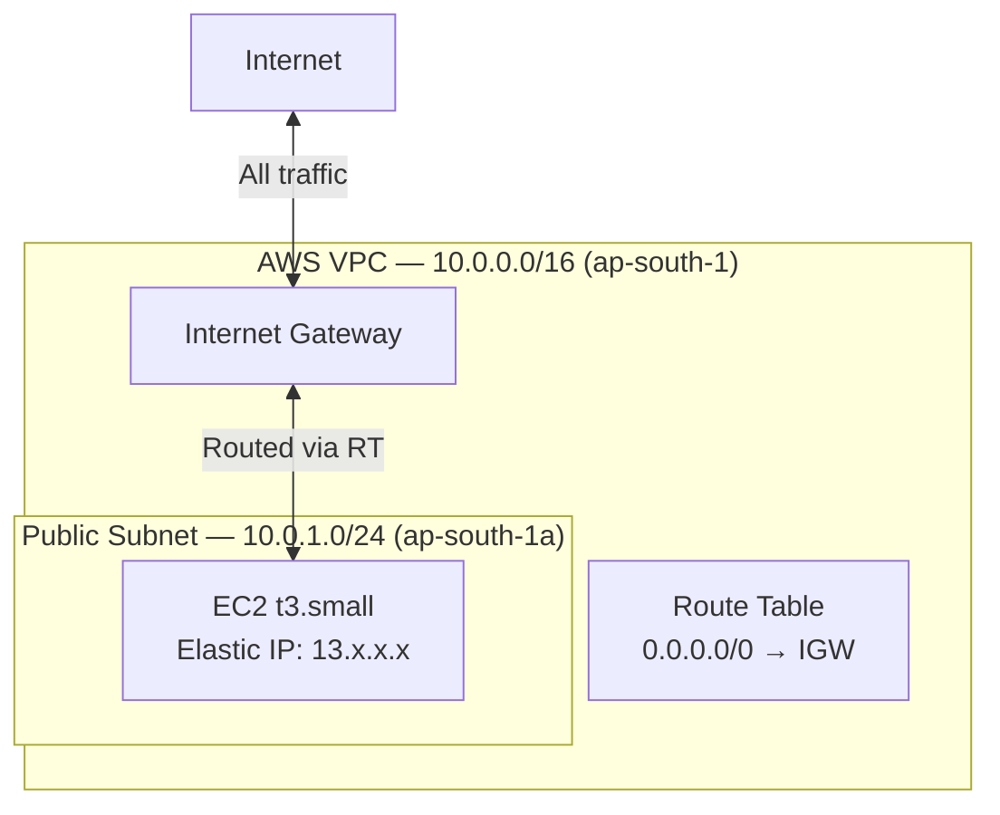
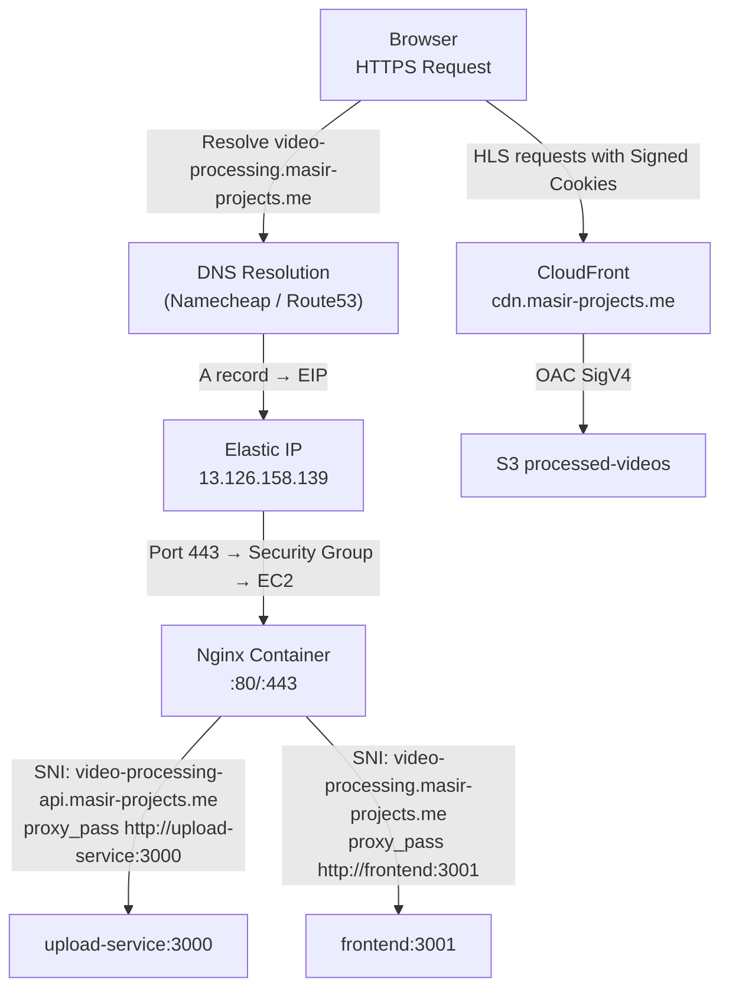
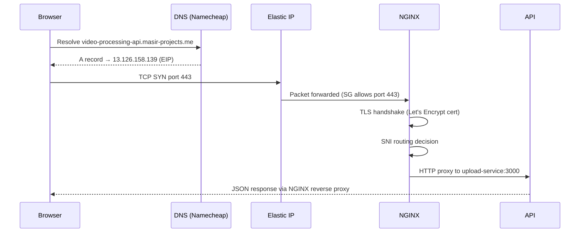

# Networking

This document describes the network architecture of Flux — VPC design, security group rules, DNS flow, TLS termination, and request routing from the browser to each backend service.

---

## VPC Design



| Resource | CIDR / Value | Notes |
|---|---|---|
| VPC | `10.0.0.0/16` | Allows up to 65,536 addresses |
| Public subnet | `10.0.1.0/24` | 254 usable host addresses |
| Availability zone | `ap-south-1a` | Single AZ (no HA currently) |
| Internet Gateway | Attached to VPC | Allows bidirectional internet access |
| Route table | `0.0.0.0/0 → IGW` | Default route via IGW |
| Map public IP | Enabled | EC2 auto-assigns public IP (overridden by EIP) |

**Current limitations**:
- **Single AZ**: If the AZ experiences an outage, the entire platform is unavailable.
- **No private subnets**: PostgreSQL and Redis run inside Docker on the EC2 instance. In a production setup, these should run in private subnets (RDS + ElastiCache) unreachable from the internet.
- **No NAT Gateway**: Since all resources are in a public subnet, outbound internet access goes directly through the IGW.

**Future improvements**:
```
VPC 10.0.0.0/16
├── Public Subnet A (10.0.1.0/24) — AZ-a: EC2, ALB
├── Public Subnet B (10.0.2.0/24) — AZ-b: EC2 (replica), ALB
├── Private Subnet A (10.0.3.0/24) — AZ-a: RDS, ElastiCache
└── Private Subnet B (10.0.4.0/24) — AZ-b: RDS (replica), ElastiCache (replica)
```

---

## Security Groups

### EC2 Security Group

| Direction | Protocol | Port | Source | Purpose |
|---|---|---|---|---|
| Inbound | TCP | 22 | `0.0.0.0/0` | SSH access |
| Inbound | TCP | 80 | `0.0.0.0/0` | HTTP (redirected to HTTPS by Nginx) |
| Inbound | TCP | 443 | `0.0.0.0/0` | HTTPS (Nginx TLS termination) |
| Inbound | TCP | 3000 | `0.0.0.0/0` | Direct API access (health checks, debugging) |
| Outbound | All | All | `0.0.0.0/0` | All outbound (AWS SDK calls, package downloads) |

**Security concerns and mitigations**:

| Concern | Current State | Recommended Fix |
|---|---|---|
| SSH from `0.0.0.0/0` | Open (security risk) | Restrict to VPN CIDR or use SSM Session Manager |
| Port 3000 from `0.0.0.0/0` | Allows bypassing Nginx | Restrict to internal traffic or remove; use Nginx exclusively |
| PostgreSQL/Redis not in SG | Containers communicate via Docker network (not SG) | Acceptable for single-instance; use separate security groups for RDS/ElastiCache |

---

## Request Routing

### Full Request Flow



---

## Nginx Configuration

Nginx acts as the edge reverse proxy with TLS termination. It runs on the host network ports 80/443 and routes traffic to internal Docker containers.

### Virtual Hosts

#### HTTP → HTTPS Redirect
```nginx
server {
    listen 80;
    server_name video-processing-api.masir-projects.me video-processing.masir-projects.me;

    location /.well-known/acme-challenge/ {
        root /var/www/certbot;   # Let's Encrypt ACME challenge
    }

    location / {
        return 301 https://$host$request_uri;
    }
}
```

#### Backend API (`video-processing-api.masir-projects.me`)
```nginx
server {
    listen 443 ssl;
    server_name video-processing-api.masir-projects.me;

    ssl_certificate     /etc/letsencrypt/live/.../fullchain.pem;
    ssl_certificate_key /etc/letsencrypt/live/.../privkey.pem;
    ssl_protocols       TLSv1.2 TLSv1.3;
    ssl_ciphers         HIGH:!aNULL:!MD5;

    # Security headers
    add_header Strict-Transport-Security "max-age=31536000; includeSubDomains" always;
    add_header X-Frame-Options SAMEORIGIN;
    add_header X-Content-Type-Options nosniff;
    add_header Referrer-Policy no-referrer;

    location / {
        limit_req zone=general burst=20 nodelay;   # Rate limiting

        proxy_pass http://upload-service:3000;
        proxy_set_header Host              $host;
        proxy_set_header X-Real-IP         $remote_addr;
        proxy_set_header X-Forwarded-For   $proxy_add_x_forwarded_for;
        proxy_set_header X-Forwarded-Proto $scheme;
    }
}
```

#### Frontend (`video-processing.masir-projects.me`)
```nginx
server {
    listen 443 ssl;
    server_name video-processing.masir-projects.me;
    # Same TLS config...
    location / {
        proxy_pass http://frontend:3001;
        # Same proxy headers...
    }
}
```

#### Fallback (plain HTTP direct IP access)
```nginx
server {
    listen 80 default_server;
    server_name _;
    location / {
        proxy_pass http://upload-service:3000;
    }
}
```

This catch-all server block serves health check requests from AWS when accessed via the raw IP address.

---

## Elastic IP

An AWS Elastic IP is allocated and associated with the EC2 instance:

```hcl
resource "aws_eip" "video_platform_eip" { domain = "vpc" }
resource "aws_eip_association" "..." {
  instance_id   = aws_instance.app_server.id
  allocation_id = aws_eip.video_platform_eip.id
}
```

**Why an Elastic IP?**
- EC2 instances are assigned a new public IP every time they stop and start.
- DNS A records cannot change on every restart without automation.
- An Elastic IP is static and persists across instance restarts.

**Cost**: Elastic IPs are **free** when associated with a running instance. They cost $0.005/hour when not associated (to discourage waste).

---

## DNS Flow



### DNS Records (Namecheap)

| Type | Host | Value | TTL |
|---|---|---|---|
| A | `video-processing` | `13.126.158.139` (EIP) | 300s |
| A | `video-processing-api` | `13.126.158.139` (EIP) | 300s |
| CNAME | `cdn` | `d1234abcd.cloudfront.net` | 300s |
| CNAME | `_acm-validation...` | ACM validation record | 300s |

---

## TLS Configuration

### EC2 (Let's Encrypt via Certbot)

- **Certificates**: Issued via Certbot ACME HTTP-01 challenge
- **Paths**: `/etc/letsencrypt/live/{domain}/fullchain.pem` and `privkey.pem`
- **Renewal**: Certbot auto-renewal (cron job on EC2 host)
- **Container access**: Mounted as read-only volume into Nginx container

```yaml
volumes:
  - /etc/letsencrypt:/etc/letsencrypt:ro
  - /var/www/certbot:/var/www/certbot:ro
```

### CloudFront (ACM)

- **Certificate**: Issued via ACM in `us-east-1`
- **Validation**: DNS CNAME validation records added in Namecheap
- **Protocol**: SNI-only, TLS 1.2 minimum (`TLSv1.2_2021`)

---

## Port Reference

| Port | Service | Accessible From |
|---|---|---|
| 22 | SSH | Internet (EC2 SG — restrict in production) |
| 80 | HTTP | Internet → Nginx redirect or Certbot ACME |
| 443 | HTTPS | Internet → Nginx → API or Frontend |
| 3000 | Upload Service | Internet (EC2 SG — direct access allowed for debugging) |
| 3001 | Frontend | Docker network only (Nginx proxies) |
| 5432 | PostgreSQL | Docker network only (no external SG rule) |
| 6379 | Redis | Docker network only (no external SG rule) |

---

## Rate Limiting

Two layers of rate limiting protect the API:

### Nginx Layer
```nginx
limit_req_zone $binary_remote_addr zone=general:10m rate=10r/s;

location / {
    limit_req zone=general burst=20 nodelay;
}
```
- Allows 10 requests/second per IP
- Burst of 20 requests without delay
- Returns `503` when limit is exceeded

### Express Layer (express-rate-limit)
```js
const limiter = rateLimit({
  windowMs: 15 * 60 * 1000,  // 15 minutes
  max: 100,                   // 100 requests per window
  message: "Too many requests",
});
```
- Catches requests that bypass Nginx (port 3000 direct access)
- Returns `429 Too Many Requests`
