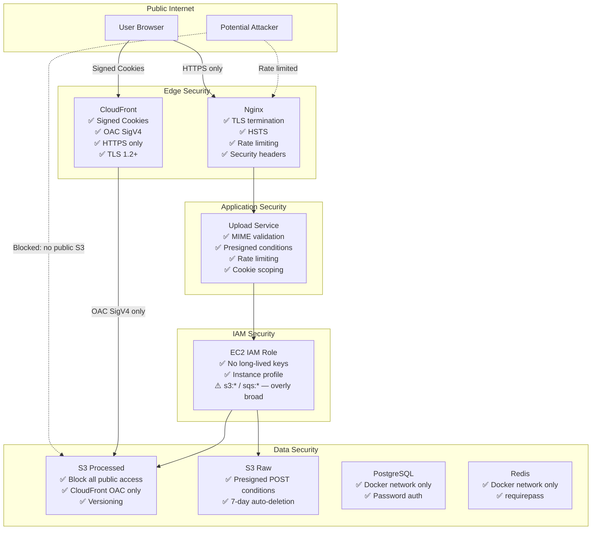
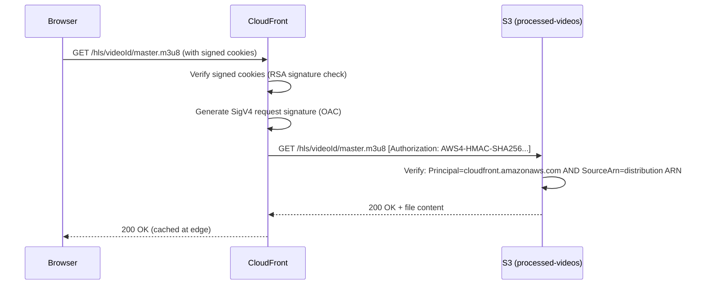

# Security

This document provides a comprehensive security analysis of Flux — including the design of each security mechanism, current risks, and recommended improvements.

---

## Security Architecture Overview



---

## CloudFront OAC (Origin Access Control)

### What It Is

OAC is the mechanism by which CloudFront authenticates itself to S3. Every request from CloudFront to S3 is signed with AWS SigV4 credentials belonging to the CloudFront service principal. The S3 bucket policy then allows only requests from the specific CloudFront distribution ARN.

### How It Works



### S3 Bucket Policy

```json
{
  "Statement": [{
    "Sid": "AllowCloudFrontService",
    "Effect": "Allow",
    "Principal": { "Service": "cloudfront.amazonaws.com" },
    "Action": ["s3:GetObject"],
    "Resource": "arn:aws:s3:::Flux-dev-processed-videos/*",
    "Condition": {
      "StringEquals": {
        "AWS:SourceArn": "arn:aws:cloudfront::123456789012:distribution/E1ABCDEF"
      }
    }
  }]
}
```

The `AWS:SourceArn` condition is **critical** — without it, any CloudFront distribution could access the bucket by passing `cloudfront.amazonaws.com` as the principal. With it, only the Flux distribution can read from this bucket.

### OAC vs OAI (Legacy)

| Feature | OAI (Legacy) | OAC (Current) |
|---|---|---|
| Signing method | S3 pre-signed URL pattern | SigV4 (same as IAM) |
| S3 SSE-KMS support | No | Yes |
| Security model | Tied to OAI principal | Tied to distribution ARN |
| AWS recommendation | Deprecated | Recommended |

---

## CloudFront Signed Cookies

### Why Signed Cookies Instead of Signed URLs

HLS video playback generates hundreds of S3 requests per video session:
- 1 × master.m3u8
- 3 × variant index.m3u8 files
- N × .ts segment files (N = video_duration_seconds / 6)

Embedding a unique signed URL into every segment reference is impractical. Signed cookies solve this with a single authentication token that applies to all requests matching the resource pattern.

### Cookie Structure

Three cookies are set on the browser:

| Cookie Name | Content | Purpose |
|---|---|---|
| `CloudFront-Policy` | Base64-encoded JSON policy | Defines the resource pattern and expiry |
| `CloudFront-Signature` | RSA-SHA1 signature over policy | Proves the policy was issued by the trusted key pair |
| `CloudFront-Key-Pair-Id` | ID of the public key in CloudFront | Tells CloudFront which key to use for verification |

### Cookie Policy (JSON)

```json
{
  "Statement": [{
    "Resource": "https://cdn.masir-projects.me/hls/a1b2c3d4-.../*",
    "Condition": {
      "DateLessThan": {
        "AWS:EpochTime": 1749999999
      }
    }
  }]
}
```

The wildcard `/*` is intentional — it covers all objects under the video's HLS prefix: master playlist, all variant playlists, and all `.ts` segments.

### Cookie Issuance Flow

```js
// Server-side (cookie.service.js)
const cookies = getSignedCookies({
  keyPairId: process.env.CLOUDFRONT_KEY_PAIR_ID,
  privateKey,               // RSA private key (2048-bit)
  policy: JSON.stringify({
    Statement: [{
      Resource: `https://${CLOUDFRONT_DOMAIN}/hls/${videoId}/*`,
      Condition: {
        DateLessThan: { "AWS:EpochTime": expiryEpoch }
      }
    }]
  }),
});
```

### Cookie Settings

```js
const cookieOptions = [
  "Path=/",
  "Secure",          // HTTPS only
  "SameSite=None",   // Required for cross-origin credentialed requests
  "Max-Age=7200",    // 2 hours (matches COOKIE_EXPIRY_HOURS=2)
  `Domain=.masir-projects.me`,  // Shared across api.masir-projects.me and cdn.masir-projects.me
].join("; ");
```

**`SameSite=None`** is required because the cookies are set on `video-processing-api.masir-projects.me` but consumed by the browser when making requests to `cdn.masir-projects.me` (a different subdomain). Cross-site cookie sending requires `SameSite=None; Secure`.

**`Domain=.masir-projects.me`** (note the leading dot) makes the cookies available to all subdomains of `masir-projects.me`, including both the API and CDN subdomains.

### RSA Key Pair Management

```bash
# Key generation (one-time, offline)
openssl genrsa -out infra/keys/cloudfront-private.pem 2048
openssl rsa -pubout -in infra/keys/cloudfront-private.pem -out infra/keys/cloudfront-public.pem
```

| Key | Location | Use |
|---|---|---|
| Public key | Uploaded to CloudFront via Terraform (`aws_cloudfront_public_key`) | Verifies cookie signatures |
| Private key | Mounted into container at `/app/keys/cloudfront-private.pem` (read-only) | Signs cookies |

**Private key loading** (supports both file path and inline PEM for Docker/CI):
```js
if (process.env.CLOUDFRONT_PRIVATE_KEY_PATH) {
  privateKey = fs.readFileSync(process.env.CLOUDFRONT_PRIVATE_KEY_PATH, "utf8");
} else if (process.env.CLOUDFRONT_PRIVATE_KEY) {
  privateKey = process.env.CLOUDFRONT_PRIVATE_KEY.replace(/\\n/g, "\n");
}
```

---

## IAM Roles and Least Privilege

### Current State

The EC2 instance profile has two inline policies:

```hcl
# Overly broad — should be restricted to specific bucket ARNs
{ "Action": ["s3:*"], "Resource": "*" }

# Overly broad — should be restricted to specific queue ARN
{ "Action": ["sqs:*"], "Resource": "*" }
```

### Recommended Least-Privilege Policies

```json
{
  "Statement": [
    {
      "Sid": "WorkerReadRaw",
      "Effect": "Allow",
      "Action": ["s3:GetObject"],
      "Resource": "arn:aws:s3:::Flux-dev-raw-videos/*"
    },
    {
      "Sid": "WorkerWriteProcessed",
      "Effect": "Allow",
      "Action": ["s3:PutObject"],
      "Resource": [
        "arn:aws:s3:::Flux-dev-processed-videos/*",
        "arn:aws:s3:::Flux-dev-thumbnails/*"
      ]
    },
    {
      "Sid": "APIGeneratePresignedPost",
      "Effect": "Allow",
      "Action": ["s3:PutObject"],
      "Resource": "arn:aws:s3:::Flux-dev-raw-videos/raw/*"
    },
    {
      "Sid": "WorkerSQSAccess",
      "Effect": "Allow",
      "Action": ["sqs:ReceiveMessage", "sqs:DeleteMessage", "sqs:GetQueueAttributes"],
      "Resource": "arn:aws:sqs:ap-south-1:123456789012:Flux-dev-video-processing"
    },
    {
      "Sid": "APIGWPostToConnection",
      "Effect": "Allow",
      "Action": ["execute-api:ManageConnections"],
      "Resource": "arn:aws:execute-api:ap-south-1:123456789012:{api-id}/production/POST/@connections/*"
    }
  ]
}
```

### No Long-Lived Access Keys

The EC2 instance uses an **IAM instance profile** — credentials are automatically provided by the EC2 metadata service (IMDSv2) and rotated every few hours. No `AWS_ACCESS_KEY_ID` / `AWS_SECRET_ACCESS_KEY` environment variables are required or stored in `.env` files for runtime AWS API calls.

---

## HTTPS Enforcement

- **Nginx**: HTTP (port 80) issues `301 Permanent Redirect` to HTTPS for all non-ACME paths
- **CloudFront**: `viewer_protocol_policy = "redirect-to-https"` — any HTTP request is permanently redirected
- **HSTS**: `Strict-Transport-Security: max-age=31536000; includeSubDomains` on both Nginx vhosts — browsers cache this for 1 year and refuse HTTP connections

---

## Secrets Management

| Secret | Storage | Access |
|---|---|---|
| CloudFront private key | File on EC2 + mounted volume, or inline `.env` | Read-only filesystem volume |
| PostgreSQL password | `.env` file → Docker Compose env var | Docker internal only |
| Redis password | `.env` file → `redis-server --requirepass` | Docker internal only |
| AWS SDK credentials | IAM instance profile (no stored keys) | Automatic via EC2 metadata |
| GitHub Actions SSH key | GitHub Actions Secret (`EC2_SSH_KEY`) | SSH connection only |

### `.env` File Security

The `.env` file at `infra/docker/.env` contains all secrets. Current risks:
- It is on the EC2 instance filesystem (readable by root)
- It is NOT committed to git (confirmed by `.gitignore`)

**Recommended improvement**: Use **AWS Secrets Manager** or **AWS Parameter Store** to store secrets, and inject them at container startup using `aws secretsmanager get-secret-value`. This eliminates plaintext secrets from the filesystem.

---

## Security Risks and Mitigations

| Risk | Severity | Current Mitigation | Recommended Fix |
|---|---|---|---|
| SSH open to `0.0.0.0/0` | High | None | Restrict to VPN CIDR or use SSM Session Manager only |
| IAM policies use `s3:*` and `sqs:*` | Medium | None | Implement least-privilege per above |
| `.env` file on EC2 filesystem | Medium | Not in git; file permissions | Migrate to AWS Secrets Manager |
| `SameSite=None` cookies | Low | `Secure` flag enforced | Acceptable for cross-origin cookie use case |
| No WAF (Web Application Firewall) | Medium | Nginx rate limiting | Add AWS WAF rules to CloudFront for OWASP Top 10 |
| No CloudTrail audit logging | Medium | None | Enable CloudTrail for all API calls |
| No MFA on AWS root account | High | Unknown | Enable MFA on root + use IAM users with MFA |
| Port 3000 open from internet | Low | Rate limiting in Express | Remove port 3000 ingress rule; route everything through Nginx |
| No VPC Flow Logs | Low | None | Enable for network traffic auditing |

---

## Future Security Enhancements

1. **AWS WAF on CloudFront**: Block SQL injection, XSS, and OWASP Top 10 attacks at the edge.
2. **AWS Secrets Manager**: Rotate DB passwords, Redis passwords, and CloudFront private key on a schedule.
3. **VPC Endpoints for S3/SQS**: Ensure worker traffic to S3 and SQS stays within AWS network (no internet transit).
4. **IMDSv2 enforcement**: Require IMDSv2 token-based metadata access on EC2 to prevent SSRF attacks from accessing instance credentials.
5. **Certificate pinning**: Pin the CloudFront certificate in the frontend for high-security deployments.
6. **CSP Headers**: Add `Content-Security-Policy` headers to the frontend to prevent XSS.
7. **CORS tightening**: Restrict raw bucket CORS `allowed_origins` from `*` to the specific frontend domain.
8. **Separate IAM users for Terraform**: Use a dedicated IAM user with minimal permissions for CI/CD Terraform applies, separate from the EC2 instance role.
