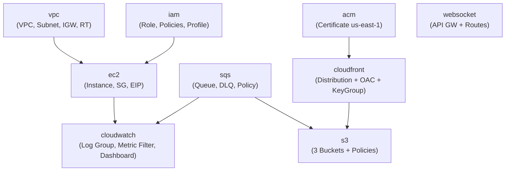

# Terraform Infrastructure

This document explains Flux's Infrastructure as Code approach using Terraform — module structure, environment organisation, state management, variable conventions, and the dependency graph between resources.

---

## Module Structure

```
infra/terraform/
├── environments/
│   └── dev/
│       ├── main.tf          # Module composition — calls all modules
│       ├── variables.tf     # Input variables for the environment
│       ├── terraform.tfvars # Actual variable values (committed — no secrets)
│       ├── outputs.tf       # Environment-level outputs (IPs, URLs, etc.)
│       └── providers.tf     # AWS provider config + us-east-1 alias for ACM
└── modules/
    ├── vpc/                 # VPC, subnets, internet gateway, route tables
    ├── ec2/                 # EC2 instance, security group, Elastic IP
    ├── iam/                 # IAM role, policies, instance profile
    ├── s3/                  # Three S3 buckets + policies + notifications
    ├── sqs/                 # Main queue + DLQ + queue policy
    ├── cloudfront/          # CloudFront distribution + OAC + key group
    ├── acm/                 # ACM certificate (us-east-1 provider alias)
    └── websocket/           # API Gateway WebSocket API + routes + integrations
```

---

## Environment Structure

Currently, a single `dev` environment exists. The module-based architecture is designed to support multiple environments (`staging`, `prod`) by adding new environment directories:

```
environments/
├── dev/        ← current
├── staging/    ← future
└── prod/       ← future
```

Each environment directory would call the same modules with different variable values (e.g., different instance types, S3 bucket names, domain names).

---

## Module Deep Dives

### VPC Module

```hcl
resource "aws_vpc" "main" {
  cidr_block           = var.vpc_cidr        # 10.0.0.0/16
  enable_dns_hostnames = true
  enable_dns_support   = true
}

resource "aws_subnet" "public" {
  vpc_id                  = aws_vpc.main.id
  cidr_block              = var.public_subnet_cidr  # 10.0.1.0/24
  map_public_ip_on_launch = true
}

resource "aws_internet_gateway" "igw" { ... }
resource "aws_route_table" "public" {
  route { cidr_block = "0.0.0.0/0"; gateway_id = igw.id }
}
```

**Outputs**: `vpc_id`, `public_subnet_id`

**Design note**: Currently a single public subnet in one AZ. A production setup would use two public subnets across two AZs for HA, plus private subnets for the database and cache layers.

---

### EC2 Module

```hcl
resource "aws_security_group" "ec2_sg" {
  ingress { from_port=22;  protocol="tcp"; cidr_blocks=["0.0.0.0/0"] }  # SSH
  ingress { from_port=80;  protocol="tcp"; cidr_blocks=["0.0.0.0/0"] }  # HTTP
  ingress { from_port=443; protocol="tcp"; cidr_blocks=["0.0.0.0/0"] }  # HTTPS
  ingress { from_port=3000;protocol="tcp"; cidr_blocks=["0.0.0.0/0"] }  # API (direct)
  egress  { from_port=0;   protocol="-1";  cidr_blocks=["0.0.0.0/0"] }  # All outbound
}

resource "aws_instance" "app_server" {
  ami           = "ami-03bb6d83c60fc5f7c"  # Ubuntu 22.04 (ap-south-1)
  instance_type = "t3.small"
  root_block_device { volume_size=30; volume_type="gp2" }
  iam_instance_profile = var.instance_profile_name
}

resource "aws_eip" "video_platform_eip" { domain = "vpc" }
resource "aws_eip_association" "..." { instance_id=...; allocation_id=... }
```

**Outputs**: `instance_id`, `elastic_ip`

**Security note**: SSH port 22 is open to `0.0.0.0/0`. In production, this should be restricted to a VPN CIDR or bastion host IP, or replaced with SSM Session Manager (the `AmazonSSMManagedInstanceCore` policy is already attached).

---

### IAM Module

```hcl
resource "aws_iam_role" "ec2_role" {
  assume_role_policy = { Service = "ec2.amazonaws.com" }
}

# Managed policies
resource "aws_iam_role_policy_attachment" "ssm" {
  policy_arn = "arn:aws:iam::aws:policy/AmazonSSMManagedInstanceCore"
}
resource "aws_iam_role_policy_attachment" "cloudwatch_agent" {
  policy_arn = "arn:aws:iam::aws:policy/CloudWatchAgentServerPolicy"
}

# Inline policies (currently overly broad)
resource "aws_iam_role_policy" "s3_access"  { Action=["s3:*"] }
resource "aws_iam_role_policy" "sqs_access" { Action=["sqs:*"] }

resource "aws_iam_instance_profile" "ec2_profile" { role = aws_iam_role.ec2_role.name }
```

**Outputs**: `instance_profile_name`

---

### S3 Module

Creates three buckets with full configuration:

```hcl
# raw-videos: receives direct browser uploads
resource "aws_s3_bucket_notification" "raw_upload_events" {
  queue { queue_arn = var.video_queue_arn; events = ["s3:ObjectCreated:*"]; filter_prefix = "raw/" }
}
resource "aws_s3_bucket_lifecycle_configuration" "raw_lifecycle" {
  rule { id="delete-old-videos"; expiration { days=7 } }
}

# processed-videos: private, OAC-only access
resource "aws_s3_bucket_policy" "processed_public_policy" {
  policy = {
    Principal = { Service = "cloudfront.amazonaws.com" }
    Action    = ["s3:GetObject"]
    Condition = { StringEquals = { "AWS:SourceArn" = var.cloudfront_distribution_arn } }
  }
}
resource "aws_s3_bucket_public_access_block" "processed_public_access" {
  block_public_acls=true; block_public_policy=true; restrict_public_buckets=true
}
```

**Outputs**: `processed_bucket_domain_name`, `thumbnails_bucket_domain_name`

---

### SQS Module

```hcl
resource "aws_sqs_queue" "dead_letter_queue" {
  name = "${var.project_name}-${var.environment}-dlq"
}

resource "aws_sqs_queue" "video_processing_queue" {
  name                       = "${var.project_name}-${var.environment}-video-processing"
  visibility_timeout_seconds = 300
  redrive_policy = jsonencode({
    deadLetterTargetArn = aws_sqs_queue.dead_letter_queue.arn
    maxReceiveCount     = 3
  })
}

resource "aws_sqs_queue_policy" "allow_s3" {
  # Allows S3 service to SendMessage to this queue
  policy = { Principal = { Service = "s3.amazonaws.com" }; Action = "sqs:SendMessage" }
}
```

**Outputs**: `queue_url`, `queue_arn`, `queue_name`, `dlq_name`

---

### CloudFront Module

```hcl
# RSA public key for signed cookies
resource "aws_cloudfront_public_key" "key" {
  encoded_key = var.cloudfront_public_key_pem
  lifecycle { create_before_destroy = true }
}

resource "aws_cloudfront_key_group" "key_group" {
  items = [aws_cloudfront_public_key.key.id]
}

# OAC — replaces legacy OAI
resource "aws_cloudfront_origin_access_control" "processed_bucket_oac" {
  signing_behavior = "always"
  signing_protocol = "sigv4"
}

resource "aws_cloudfront_distribution" "video_cdn" {
  # Two origins: processed-videos + thumbnails
  # Default behavior: signed cookies required
  # /thumbnails/* behavior: no signed cookies
  # trusted_key_groups = [key_group.id]
  viewer_certificate { acm_certificate_arn = var.acm_certificate_arn; minimum_protocol_version = "TLSv1.2_2021" }
  price_class = "PriceClass_100"
}

# CORS headers for credentialed cookie requests
resource "aws_cloudfront_response_headers_policy" "cors_policy" {
  cors_config {
    access_control_allow_credentials = true
    access_control_allow_origins { items = ["https://video-processing.masir-projects.me"] }
    access_control_allow_methods { items = ["GET", "HEAD", "OPTIONS"] }
  }
}
```

**Outputs**: `distribution_domain_name`, `distribution_arn`, `cloudfront_key_pair_id`

---

### WebSocket Module

```hcl
resource "aws_apigatewayv2_api" "websocket_api" {
  protocol_type              = "WEBSOCKET"
  route_selection_expression = "$request.body.action"
}

resource "aws_apigatewayv2_integration" "connect_integration" {
  integration_type   = "HTTP_PROXY"
  integration_uri    = "https://video-processing-api.masir-projects.me/websocket/connect"
  request_parameters = { "integration.request.header.x-connection-id" = "context.connectionId" }
}

resource "aws_apigatewayv2_route" "connect_route" { route_key = "$connect" }
resource "aws_apigatewayv2_route" "disconnect_route" { route_key = "$disconnect" }
```

**Outputs**: `websocket_endpoint`

---

### ACM Module

```hcl
resource "aws_acm_certificate" "cdn_cert" {
  domain_name       = var.cdn_domain_name
  validation_method = "DNS"
  lifecycle { create_before_destroy = true }
}
```

Called with the `aws.us_east_1` provider alias (CloudFront requires certs in us-east-1).

**Outputs**: `certificate_arn`, `domain_validation_options`

---

## State Management

**Current**: Local state (`terraform.tfstate` stored on the developer's machine / EC2 instance).

**Limitation**: Local state means:
- No team collaboration (concurrent applies would conflict)
- State is lost if the machine is lost
- No locking (concurrent runs can corrupt state)

**Recommended upgrade**: Remote state in S3 with DynamoDB locking:

```hcl
terraform {
  backend "s3" {
    bucket         = "Flux-terraform-state"
    key            = "dev/terraform.tfstate"
    region         = "ap-south-1"
    dynamodb_table = "Flux-terraform-locks"
    encrypt        = true
  }
}
```

---

## Variables

### `environments/dev/variables.tf`

| Variable | Type | Description |
|---|---|---|
| `project_name` | string | Used as prefix for all resource names |
| `environment` | string | `dev`, `staging`, `prod` |
| `cdn_domain_name` | string | Custom domain for CloudFront (e.g., `cdn.masir-projects.me`) |

### `environments/dev/terraform.tfvars`

```hcl
project_name    = "Flux"
environment     = "dev"
cdn_domain_name = "cdn.masir-projects.me"
```

---

## Outputs

```hcl
output "elastic_ip"            { value = module.ec2.elastic_ip }
output "websocket_endpoint"    { value = module.websocket.websocket_endpoint }
output "cloudfront_domain"     { value = module.cloudfront.distribution_domain_name }
output "cloudfront_key_pair_id" { value = module.cloudfront.cloudfront_key_pair_id }
output "acm_validation_records" { value = module.acm.domain_validation_options }
```

After `terraform apply`, these outputs provide the values needed to configure:
- DNS A records (elastic_ip)
- Backend `.env` `WEBSOCKET_API_ENDPOINT` and `CLOUDFRONT_KEY_PAIR_ID`
- Frontend `.env` `NEXT_PUBLIC_CLOUDFRONT_DOMAIN`

---

## Dependency Graph



**Dependency notes**:
- `s3` depends on `sqs` (needs `queue_arn` for bucket notification) and `cloudfront` (needs `distribution_arn` for bucket policy)
- `cloudfront` depends on `acm` (needs certificate ARN) and `s3` (needs bucket domain names)
- `ec2` depends on `vpc` (needs subnet and VPC IDs) and `iam` (needs instance profile name)
- `cloudwatch` dashboard depends on `ec2` (needs instance ID) and `sqs` (needs queue names)

---

## Running Terraform

```bash
# One-time setup
cd infra/terraform/environments/dev

# Initialise providers and modules
terraform init

# Preview changes (always do this first!)
terraform plan

# Apply infrastructure changes
terraform apply

# After apply — get required config values
terraform output -json

# Targeted resource apply (useful for individual module updates)
terraform apply -target=module.cloudfront

# Destroy (careful!)
terraform destroy
```

---

## CloudFront Key Pair Setup

The signed cookie system requires a RSA-2048 key pair. This is a one-time setup:

```bash
# Generate key pair (outside Terraform — keys are sensitive)
openssl genrsa -out infra/keys/cloudfront-private.pem 2048
openssl rsa -pubout -in infra/keys/cloudfront-private.pem -out infra/keys/cloudfront-public.pem

# The public key is read by Terraform:
# cloudfront_public_key_pem = file("${path.module}/../../../keys/cloudfront-public.pem")

# The private key is mounted into the upload-service container:
# volumes: - ../../infra/keys/cloudfront-private.pem:/app/keys/cloudfront-private.pem:ro
```

> ⚠️ **Never commit private keys to git.** Add `infra/keys/*.pem` to `.gitignore`. The `.env` file can alternatively store the private key as an inline PEM string (with `\n` escaped).
